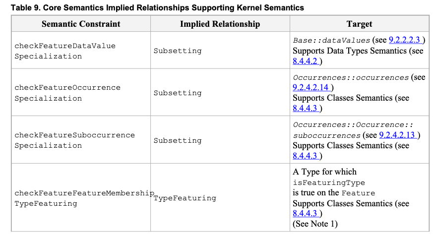
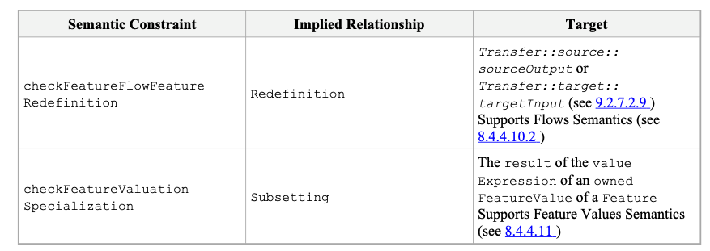

# 8.4 Semantics

## 8.4.1 Semantics Overview

A KerML model is intended to *represent* a system being modeled. The model is *interpreted* to make statements about the
modeled system. The model may describe an existing system, in which case, if the model is correct, the statements it is
interpreted to make about the system should all be true. A model may also be used to specify an imagined or planned
system, in which case the statements the model is interpreted to make should be true for any system that is properly
constructed and operated according to the model.

The *semantics* of KerML specify how a KerML model is to be interpreted. The semantics are defined in terms of the
abstract syntax representation of the model, and only for models which are *valid* relative to the structure and
constraints specified for the KerML abstract syntax (see 8.3). As further specified in this subclause, models expressed
in KerML are given semantics by implicitly reusing elements from the semantic models in the Kernel Model Library (see
Clause 9). These library models represent conditions on the structure and behavior of the system being modeled, which
are further augmented in a user model as appropriate.

A formal specification of semantics allows models to be interpreted consistently. In particular, all KerML models extend
library models expressed in KerML itself, understandable by KerML modelers. These library models can then be ultimately
reduced to a small, core subset of KerML, which is grounded in mathematical logic. The goal is to provide uniform model
interpretation, which improves communication between everyone involved in modeling, including modelers and tool
builders.

KerML semantics are specified by a combination of mathematics and model libraries, as illustrated in Figure 41. The left
side of this diagram shows the abstract syntax packages corresponding to the three layers of KerML (see 6.1). The right
side shows the corresponding semantic layering.

1. The **Root Layer** defines the syntactic foundation of KerML and, as such, does not have a semantic interpretation
   relative to the modeled system.
2. The **Core Layer** is grounded in mathematical semantics, supported by the `Base` package from the Kernel Model
   Library (see 9.2.2). Subclause 8.4.3 specifies the semantics of the Core layer.
3. The **Kernel Layer** is given semantics fully through its relationship to the Model Library (see Clause 9). Subclause
   8.4.4 specifies the semantics of the Kernel layer.

*Figure 41. KerML Semantic Layers*

## 8.4.2 Semantic Constraints and Implied Relationships

As described in 8.4.1, KerML semantics are specified by a combination of a mathematical interpretation of the Core layer
and a set of required relationships between Core and Kernel model elements and elements of the Kernel Semantic Library (
see 9.2). The latter requirements are formalized by *semantic constraints* included in the KerML abstract syntax (see
also 8.3.1 on the various kinds of constraints in the abstract syntax). Additionally, other semantic constraints require
relationships between elements within a user model necessary for the model to be semantically well formed.

Specifically, there are four categories of semantic constraints, each dealing with a different kind of relationship:

1. **Specialization constraints.** These constraints require that `Type` elements of a certain kind directly or
   indirectly specialize some specific `baseType` from the Kernel Semantic Library. They are the fundamental means for
   providing semantics to abstract syntax elements in the Kernel layer. Specialization constraints always have the word
   *Specialization* in their name. For example, `checkDataTypeSpecialization` requires that a `DataType` directly or
   indirectly specialize the Semantic Library DataType `Base::DataValue`.

2. **Redefinition constraints.** These constraints require that certain `Features` in a model have `Redefinition`
   relationships with certain other `Features` in the model. While `Redefinitions` are kinds of `Specializations`,
   redefinition constraints differ from the specialization constraints described above in that they are between two
   elements of a user model, rather than between an element of a user model and an element of a library model.
   Redefinition constraints always have the word *Redefinition* in their name. For example,
   `checkConnectorEndRedefinition` requires that the ends of a `Connector` redefine any ends of the `Types` that it
   specializes.

3. **Type-featuring constraints.** These constraints require that certain `Features` in a model have `TypeFeaturing`
   relationships with certain other `Types` in the model. They arise at points in a model in which the
   `OwningMembership` structure is different than the required `Featuring` relationship, so `FeatureMembership` cannot
   be used. Type-featuring constraints always have the words *TypeFeaturing* in their name. For example,
   `checkFeatureValueExpressionTypeFeaturing` requires that the `valueExpression` owned by a `FeatureValue`
   relationship (a kind of `OwningMembership`) have the same `featuringTypes` as the owning `featureWithValue` of the
   `FeatureValue`, rather than being featured by the `featureWithValue` itself (as would have been the case for a
   `FeatureMembership`).

4. **Binding-connector constraints.** These constraints require that `BindingConnectors` exist between certain
   `Features` in a model. The primary example of such a constraint is `checkFeatureValueBindingConnector`, which
   requires that the `featureWithValue` of a `FeatureValue` own a `BindingConnector` between itself and the `result`
   parameter of the `valueExpression` of the `FeatureValue`.

A KerML model parsed from the textual concrete syntax (see 8.2) or obtained through model interchange (see Clause 10)
will not necessarily meet the semantic constraints specified for the abstract syntax. In this case, a tool may insert
certain *implied* `Relationships` into the model in order to meet the semantic constraints. The overview subclauses for
the Core Semantics (see 8.4.3.1) and Kernel Semantics (see 8.4.4.1) include tables that define what implied
`Relationships` should be included to satisfy each semantic constraint when it would otherwise be violated. In all
cases, the semantics of a model are only defined if it meets all semantic and validation constraints (see 8.3.1).

When including implied `Relationships` for specialization constraints, it is possible that multiple such constraints may
apply to a single element. For example, a `Structure` is a kind of `Class`, which is a kind of `Classifier`, and there
are specialization constraints for all three of these metaclasses, with corresponding implied `Subclassification`
`Relationships`. However, simply including all three implied `Subclassifications` would be redundant, because the
`Subclassification` implied by the `checkStructureSpecialization` constraint will also automatically satisfy the
`checkClassSpecialization` and `checkClassifierSpecialization` constraints.

Therefore, in order to avoid redundant `Relationships`, a tool should observe the following rules when selecting which
`Specializations` to actually include for a certain `specificType`, out of the set of those implied by all
specialization constraints applicable to the `Type`:

1. If there is any `ownedSpecialization` or other implied `Specialization` whose `generalType` is a direct or indirect
   subtype of (but not the same as) the `generalType` of an implied `Specialization`, or if there is an
   `ownedSpecialization` with the same `generalType`, then that implied `Specialization` should *not* be included.

2. If there are two implied `Specializations` with the same `generalType`, then only one should be included.

> **Note:** The above rules do *not* apply to `Redefinitions` implied by redefinition constraints, because
`Redefinition` relationships have semantics beyond just basic `Specialization`.

## 8.4.3 Core Semantics

### 8.4.3.1 Core Semantics Overview

#### 8.4.3.1.1 Core Semantic Constraints

The Core semantics are primarily specified mathematically, but the Core metaclasses `Type`, `Classifier`, and `Feature`
also have certain semantic constraints (see 8.4.2). Subclause 8.4.3.1.2 describes the general mathematical framework for
Core semantics, with specific rules for `Types`, `Classifiers` and `Features` given in 8.4.3.2, 8.4.3.3, and 8.4.3.4,
respectively. The following summarizes the corresponding semantic constraints.

The `checkTypeSpecialization` and `checkFeatureSpecialization` constraints are actually already implied by the
mathematical semantics for `Types` and `Features`, but they are included in the abstract syntax so that they can also be
reflected syntactically in models by the implied `Relationships` shown in Table 8. In addition, Table 9 lists the
implied `Relationships` for semantic constraints on the Core metaclass `Feature` that actually support the semantics of
various Kernel-layer constructs, as further described in the Kernel Semantics (8.4.4) subclauses referenced in the table
entries for those constraints. In all cases, the `source` and `owningRelatedElement` of the `Relationship` is the
`Element` being constrained, with the `target` being as given in the last column of the table.

*Table 8. Core Semantics Implied Relationships*

**Notes:**

1. The `checkTypeSpecialization` constraint applies to all `Types`, but the `Subclassification` `Relationship` is only
   implied for `Classifiers` (see 8.4.3.3).

2. Satisfaction of the `checkFeatureSpecialization` constraint implies satisfaction of the `checkTypeSpecialization`
   constraint (see 8.4.3.4).

*Table 9. Core Semantics Implied Relationships Supporting Kernel Semantics*

**Notes:**

1. For the `checkFeatureFeatureMembershipTypeFeaturing` constraint, if the `Feature` has `isVariable = false`, then the
   target `Type` is the `owningType` of the `Feature`. If the `Feature` has `isVariable = true` and the `owningType` is
   the base `Class` `Occurrences::Occurrence`, then the target is `Occurrences::Occurrence::snapshots` (see 9.2.4.2.13).
   Otherwise, the target `Type` shall be constructed so as to satisfy the constraint and shall be owned as an
   `ownedRelatedElement` of the implied `TypeFeaturing` relationship. For further details, see 8.4.4.3.

2. For the `checkFeatureCrossingSpecialization` constraint on an end `Feature`, the target feature chain shall consist
   of two `Features`. The first `Feature` is owned by the chain, is typed by the `featuringType` of the
   `ownedCrossFeature` of the end `Feature`, and is featured by the `owningType` of the end `Feature`. The second
   `Feature` is the `ownedCrossFeature` of the end `Feature`. For further details, see 8.4.4.5.1.

3. For the `checkFeatureOwnedCrossFeatureTypeFeaturing` constraint, if the `owningType` of the owning end `Feature` has
   exactly two `endFeatures`, then an `ownedCrossFeature` shall be featured by the `types` of the other end than its
   owning end `Feature`. If the `owningType` has more than two `endFeatures`, then the `ownedCrossFeature` shall be
   featured by a `Feature` representing a Cartesian product of the `types` of the other `endFeatures` of the
   `owningType` than the owning end `Feature` of the `ownedCrossFeature`. For further details, see 8.4.4.5.1.

8.4.3.1.2 Core Semantics Mathematical Preliminaries
The mathematical specification of Core semantics uses a model-theoretic approach. Core mathematical semantics
are expressed in first order logic notation, extended as follows:

1.
    2.
        3. A conjunction specifying that multiple variables are members of the same set can be shortened to a
           comma-delimited series of variables followed by a single membership symbol (s1,s2∈ Sis short for
           s1∈ S ∧ s2∈ S). Quantifiers can use this in variable declarations, rather than leaving it to the body of
           the statement before an implication (∀tg,ts ∈ VT...is short for∀tg,ts tg ∈ VT ∧ ts ∈ VT ⇒
           ...).
           Dots (.) appearing between metaproperty names have the same meaning as in OCL, including implicit
           collections [OCL].
           Sets are identified in the usual set-builder notation, which specifies members of a set between curly braces
           ("{}"). The notation is extended with "#" before an opening brace to refer to the cardinality of a set.
           Elementnames appearing in the mathematical semantics refer to theElementitself, rather than its instances,
           using
           the same font conventions as given in8.1.
           The mathematical semantics use the following model-theoretic terms, explained in terms of this specification:
           Kernel Modeling Language v1.0 241
           • Vocabulary: Model elements conforming to the KerML abstract syntax, with additional restrictions given
           in this subclause.
           • Universe: All actual or potential things the vocabulary could possibly be about.
           • Interpretation: The relationship between vocabulary and mathematical structures made of elements of the
           universe.
           The above terms are mathematically defined below.
           • A vocabularyV= (VT,VC,VF) is a 3-tuple where:
           ◦ VTis a set of types (model elements classified byTypeor its specializations, see8.3.3.1).
           ◦ VC⊆ VTis a set of classifiers (model elements classified byClassifieror its specializations,
           see8.3.3.2), including at leastBase::Anythingfrom KerML Semantic Model Library, see
           9.2.2).
           ◦ VF⊆VTis a set of features (model elements classified byFeatureor its specializations, see
           8.3.3.3), including at leastBase::thingsfrom the KerML Semantic Model Library (see9.2.2
           ).
           ◦ VT=VC∪ VF
           • An interpretationI= (Δ, Σ , ⋅
           T) forVis a 3-tuple where:
           ◦ Δis a non-empty set (universe),
           ◦ Σ=(P,
           
h ∧ i≤length(s2) ⇒ at(s1,i−h)=at(s2,i)
           • head-tailis true if the first and second sequences are the head and tail of the third sequence,
           respectively,
           otherwise is false:
           ∀s1,s2 head-tail(s1,s2,s0)⇒
           form:Sequence(s1)∧ form:Sequence(s2)∧ form:Sequence(s0)
           ∀s1,s2 head-tail(s1,s2,s0)≡head(s1,s0)∧ tail(s2,s0)
           • concatis true if the first sequence has the second as head, the third as tail, and its length is the sum of
           the
           lengths of the other two, otherwise is false.
           ∀s0,s1,s2 concat(s0,s1,s2)⇒ form:Sequence(s0)∧ form:Sequence(s1)∧ form:Sequence(s2)
           ∀s0,s1,s2 concat(s0,s1,s2)≡(length(s0)=length(s1)+length(s2)) ∧ head-tail(s1,s2,s0)
           • concat-aroundis true if the first sequence has the second as head, the fourth as tail, and the third
           element
           in between.
           ∀s0,s1,p,s2 concat-around(s0,s1,p,s2)⇒
           form:Sequence(s0)∧ form:Sequence(s1)∧ form:Sequence(s2)
           ∀s0,s1,p,s2 concat-around(s0,s1,p,s2)≡(length(s0)=length(s1)+length(s2)+1) ∧
           head-tail(s1,s2,s0) ∧ at(p,length(s1)+1)
           • reverseis true if the sequences have the same elements, but in reverse order, otherwise is false.
           ∀s1,s2 reverse(s1,s2)⇒ form:Sequence(s1)∧ form:Sequence(s2)
           ∀s1,s2 reverse(s1,s2)≡(length(s1)=length(s2))∧
           (∀i∈ Z+ i≥1∧ i≤length(s1)⇒ at(s1,(length(s1)−i+1)=at(s2,i))
           8.4.3.2 Types Semantics
           Abstract syntax reference:8.3.3.1
           ThecheckTypeSpecializationconstraint requires that allTypesdirectly or indirectly specialize
           Base::Anything(see9.2.2.2.1). However, there isnoimplied relationship shall be inserted to satisfy this
           constraint for aTypethat is not aClassifieror aFeature(see also8.4.3.3and8.4.3.4on Classifiers and
           Features, respectively).
           The mathematical interpretation (see8.4.3.1.2) ofTypesin a model shall satisfy the following rules:
1. All sequences in the interpretation of aTypeare in the interpretations of theTypesit specializes.
   ∀tg,ts ∈ VT tg ∈ ts.specialization.general⇒ (ts)T ⊆ (tg)T
2. No sequences in the interpretation of aTypeare in the interpretations of its disjoiningTypes.
   Kernel Modeling Language v1.0 243
3.
    4.
        5. ∀t,td ∈ VT td ∈ t.disjoiningTypeDisjoining.disjoiningType⇒ ((t)T ∩(td)T
           =∅ )
           The interpretations of aTypethat hasunioningTypesare all and only the interpretations of those
           Types.
           ∀t∈ VT,utl form:Sequence(utl) ∧ utl=t.unioningTypes ∧ length(utl)>0⇒
           (t)T
           = ∪i=1
           length(utl)(at(utl,i))T
           The interpretations of aTypethat hasintersectingTypesare all and only the interpretations in
           common between all theTypes.
           ∀t∈ VT,itl form:Sequence(itl) ∧ itl=t.intersectingTypes ∧ length(itl)>0⇒
           (t)T
           = ∩i=1
           length(itl)(at(itl,i))T
           The interpretations of aTypethat hasdifferencingTypesare all and only the interpretations of the
           firstdifferencingTypethat are not interpretations of the remaining ones.
           ∀t∈ VT,dtl form:Sequence(dtl) ∧ dtl=t.differencingTypes ∧ length(dtl)>0⇒
           (t)T
           = (at(dtl,1))T ∖ ∪i=2
           length(dtl)(at(dtl,i))T
           8.4.3.3 Classifiers Semantics
           Abstract syntax reference:8.3.3.2
           ThecheckTypeSpecializationconstraint is semantically required forClassifiersby the rules below. If
           necessary, it may be syntactically satisfied in a model by inserting an impliedSubclassification
           RelationshiptoBase::Anything(see alsoTable 8).
           The mathematical interpretation (see 8.4.3.1.2) of theClassifiersin a model shall satisfy the following
           rules:
1. If the interpretation of aClassifierincludes a sequence, it also includes the 1-tail of that sequence.
   ∀c∈ VC,s1∈ S s1∈ (c)T ⇒ (∀s2∈ S tail(s2,s1)∧ length(s2)=1⇒ s2∈ (c)T)
2. The interpretation of theClassifierAnythingincludes all sequences of all elements of the universe
   and markings.
   (Anything)T
   8.4.3.4 Features Semantics
   Abstract syntax reference:8.3.3.3
   ThecheckFeatureSpecializationconstraint is semantically required by the first two rules below, combined
   with the definition of.
   Tin8.4.3.1.2. If necessary, it may be syntactically satisfied in a model by inserting an
   impliedSubsettingRelationshiptoBase::things(see alsoTable 8). Note that satisfaction of the
   checkFeatureSpecializationconstraint implies satisfaction of thecheckTypeSpecializationconstraint,
   becauseBase::thingsis aFeatureTypingspecialization ofBase::Anything.
   The mathematical interpretation (see8.4.3.1.2) of theFeaturesin a model shall satisfy the following rules:
1. The interpretations ofFeaturesmust have length greater than two.
   ∀s∈ S,f∈ VF s∈ (f)T ⇒ length(s)>2
   =S
   244 Kernel Modeling Language v1.0
2. The interpretation of theFeaturethingsis all sequences of length greater than two.
   (things)T
   ={s | s∈ S∧ length(s)>2}
   See other rules below.
   Featuresinterpreted as sequences of length three or more can be treated as if they were interpreted as ordered
   triples ("marked" binary relations), where the first and third elements are interpretations of the domain and co-
   domain of theFeature, respectively, while the second element is amarkingfromP. The predicatefeature-pair
   below determines whether two sequences can be treated in this way.
   Two sequences are afeature pairof aFeatureif and only if the interpretation of theFeatureincludes a sequence
   s0such that following are true:
   • s0is the concatenation of the two sequences, in order, with an elements ofP(marking) marking in
   between them.
   • The first sequence is in the minimal interpretation of allfeaturingTypesof theFeature.
   • The second sequence is in the minimal interpretations of alltypesof theFeature.
   ∀s1,s2∈ S,p∈ P,f∈ VF feature-pair(s1,p,s2,f)≡
   ∃s0∈ S s0∈ (f)T ∧ concat-around(s0,s1,p,s2) ∧
   (∀t1∈ VT t1∈ f.featuringType⇒ s1∈ (t1)minT) ∧
   (∀t2∈ VT t2∈ f.type⇒ s2∈ (t2)minT)
   Markings for the sames1above can be related by<Pto orders2across multiple interpretations (values) off.
   Interpretations offcan have the sames1ands2, differing only inpto distinguish duplicates2(values off).
   The interpretation of theFeaturesin a model shall satisfy the following rules:
3.
    4.
        5. All sequences in an interpretation of aFeaturehave a tail with non-overlapping head and tail that are
           feature pairs of theFeature.
           ∀s0∈ S,f∈ VF s0∈ (f)T ⇒ ∃st,s1,s2∈ S,p∈ P tail(st,s0)∧ head-tail(s1,s2,st) ∧
           (length(st)>length(s1)+length(s2))∧ feature-pair(s1,p,s2,f)
           Values ofredefiningFeaturesare the same as the values of theirredefinedFeaturesrestricted to
           the domain of theredefiningFeature.
           ∀fg,fs ∈ VF fg ∈ fs.redefinedFeature⇒
           (∀s1∈ S (∀fts ∈ VT fts ∈ fs.featuringType⇒ s1∈ (fts)minT) ⇒
           (∀s2∈ S,p∈ P(feature-pair(s1,p,s2,fs)≡feature-pair(s1,p,s2,fg))))
           Themultiplicityof aFeatureincludes the cardinality of its values, counting duplicates.
           ∀s1∈ S,f∈ VF,n∈ Z+ (∀t1∈ VT t1∈ f.featuringType ⇒ s1∈ (t1)minT) ∧
           n=#{(p,s2)|feature-pair(s1,p,s2,f)} ⇒
           ∃p∈ Pfeature-pair(s1,p,(n),f.multiplicity)
6. If aFeatureis unique, there are no values with the same markings.
   ∀s1,s2∈ S,p1,p2∈ P,f∈ VF f.isUnique ⇒
   (feature-pair(s1,p1,s2,f)∧ feature-pair(s1,p2,s2,f) ⇒ p1=p2)
   Kernel Modeling Language v1.0 245
7.
    8.
        9. If aFeatureis ordered, the markings of its values are totally ordered and mark exactly one value each.
           ∀s1,s2,s3∈ S,p1,p2∈ P,f∈ VF f.isOrdered ⇒
           (feature-pair(s1,p1,s2,f)∧ feature-pair(s1,p2,s3,f) ⇒ (p1=p2∧ s2=s3)∨ p1<Pp2∨ p2<Pp1)
           Sequences in the interpretation of an inverting feature are the reverse of those in the inverted feature.
           ∀f1,f2∈ VF f2∈ f1.invertingFeatureInverting.invertingFeature ⇒
           (∀s1∈ S s1∈ (f1)T ≡ (∃s2∈ S s2∈ (f2)T ∧ reverse(s2,s1)))
           The interpretation of aFeaturewith a chain is determined by the interpretations of the subchains, see
           additional predicates below.
           ∀f∈ VF,cfl cfl=f.chainingFeature∧ form:Sequence(cfl)∧ length(cfl)>1⇒ chain-feature-n(f,cfl)
           The interpretations of aFeature(f) specified as a chain of two others (f1andf2) are all sequences formed from
           Featurepairs of the two others that share the same sequence as second and first in their pairs, respectively.
           Iffis
           ordered, marking order in interpretations offapplies the order off1values to those off2found via each value
           off1.
           Iffis non-unique, duplicate values off2(which might be due to multiple values off1) are preserved inf,
           otherwisef2
           can have no duplicate values (including any due to multiple values off1).
           ∀paths,sd,f1,f2,scd paths=all-chain-path-2(sd,f1,f2,scd) ⇒
           form:Set(paths) ∧ sd,scd∈ S ∧ f1,f2∈ VF
           ∀sd,f1,f2,scd all-chain-path-2(sd,f1,f2,scd) =
           {(pm,sm,pm11) | pm,pm11∈ P ∧ sm∈ S ∧
           feature-pair(sd,pm,sm,f1) ∧ feature-pair(sm,pm11,scd,f2)}
           ∀f,f1,f2 chain-feature-2(f,f1,f2)⇒ f,f1,f2∈ VF
           ∀f,f1,f2 chain-feature-2(f,f1,f2)⇒
           (∀sd,scd∈ S #{pcd | feature-pair(sd,pcd,scd,f) =
           #all-chain-path-2(f1,f2,scd))
           ∀f,f1,f2 chain-feature-2(f,f1,f2)⇒
           (∀sd,scd1,scd2,ppath1,ppath2 ∧
           ppath1∈ all-chain-path-2(f1,f2,scd1) ∧
           ppath2∈ all-chain-path-2(f1,f2,scd2) ∧
           (∀ pm1,pm11∈ P,sm1,sm2∈ S
           pm1=at(ppath1,1) ∧ sm1=at(ppath1,2) ∧ pm11=at(ppath1,3) ∧
           pm2=at(ppath2,1) ∧ sm2=at(ppath2,2) ∧ pm21=at(ppath2,3) ∧
           ((pm1
1
           ∀f,fl chain-feature-n(f,fl)≡
           ∃flc⊆ VF ∧ form:Sequence(flc) ∧ length(flc)=length(fl)−1 ∧
           (∀i∈ Z+ i>1 ∧ i<=length(fl)⇒
           chain-feature-2(at(flc,i-1), at(fl,i-1), at(fl,i)) ∧ f=at(flc,length(flc))

8.4.4 Kernel Semantics
8.4.4.1 Kernel Semantics Overview
The semantics of constructs in the Kernel Layer are specified in terms of the foundational constructs defined in the
Core layer supported by reuse of model elements from the Kernel Semantic Model Library (see 9.2). The most
common way in which library model elements are used is through specialization, in order to meet subtyping
constraints specified in the abstract syntax. For example,Structuresare required to (directly or indirectly)
subclassifyObjectfrom theObjectslibrary model, whileFeaturestyped byStructuresmust subset
objects. Similarly,Behaviorsmust subclassifyPerformancefrom thePerformanceslibrary model, while
Steps(Featurestyped byBehaviors) must subsetperformances. The requirement for such specialization is
specified by specialization constraints in the abstract syntax, as listed in Table 10along with the implied
Specializationsthat may be used to satisfy them (see8.4.2for discussion of specialization constraints and
impliedRelationships).
Sometimes more complicated reuse patterns are needed.For example, binaryAssociations(with exactly two
ends) specializeBinaryLinkfrom the library, andadditionally requirethe ends of theAssociationto redefine
thesourceandtargetends ofBinaryLink. Such patterns are specified by redefinition constraints and other
kinds of semantic constraints in the abstract syntax, as listed in Table 11along with the impliedRelationships
that may be used to satisfy them (see also8.4.2). In addition the Core semantic constraints listed inTable 9actually
support the semantics of Kernel layer constructs.
In all cases, all Kernel syntactic constructs can be ultimately reduced to semantically equivalent Core patterns.
Various elements of the Kernel abstract syntax essentially act as "markers" for modeling patterns typing the Kernel
to the Core. The following subclauses specify the semantics for each syntactic area of the Kernel Layer in terms of
the semantic constraints that must be satisfied for various Kernel elements, the pattern of relationships these imply,
and the model library elements that are reused to support this.
Table 10. Kernel Semantics Implied Specializations

Notes.

1. For all constraintsotherthancheckMetadataFeatureSemanticSpecializationand the other
   constraints listed below, thesourceof any impliedRelationshipis the annotated element of the
   constraint, with thetargetas given in the table. For
   checkMetadataFeatureSemanticSpecialization, see Note 2. For the following constraints, the
   sourceis theresultparameter of theExpressionthat is the annotated element of the constraint.
   ◦ checkFeatureReferenceExpressionResultSpecialization
   ◦ checkConstructorExpressionResultSpecialization
   ◦ checkInvocationExpressionResultSpecialization
   ◦ checkFeatureChainExpressionResultSpecialization
   ◦ checkSelectExpressionResultSpecialization
   ◦ checkIndexExpressionResultSpecialization
2. ThecheckMetadataFeatureSemanticSpecializationconstraint only applies to a
   MetadataFeaturethat has ametaclassthat is a kind ofSemanticMetadata(see9.2.16.2.3). The
   source of the impliedRelationshipfor this constraint isnottheMetadataFeaturebut, rather, the
   Typeannotated by theMetadataFeature, and a conforming tool need only insert theRelationshipif
   theMetadataFeatureis anownedMemberof theType. The kind ofRelationshipthat is implied and
   itstargetare determined as follows:
   ◦ If the annotatedTypeand thebaseTypeare bothClassifiers, thenSubclassification
   targeting thebaseType.
   ◦ If the annotatedTypeis aFeatureand thebaseTypeis aClassifier, then
   FeatureTypingtargeting thebaseType.
   ◦ If the annotatedTypeand thebaseTypeare bothFeatures, thenSubsettingtargeting the
   baseType.
   ◦ If the annotatedTypeis aClassifierand thebaseTypeis aFeature, then
   Subclassificationstargeting each of the types of theFeature.
3. For thecheckConstructorExpressionResultSpecializationand
   checkInvocationExpressionSpecializationconstraints, the impliedRelationshipis a
   Subclassificationif theinstantiatedTypeis aClassifier, aSubsettingif the
   instantiatedTypeis aFeature, and aSpecializationotherwise.
   Table 11. Kernel Semantics Other Implied Relationships

Notes

1. For redefinition and type featuring constraints, except for
   checkConstructorExpressionResultFeatureRedefinition, the annotated element of the
   252 Kernel Modeling Language v1.0
   constraint is thesourceandowningRelatedElementof the impliedRelationship, with thetarget
   as given in the last column table. For the
   checkConstructorExpressionResultFeatureRedefnitionconstraint, thesourceis an
   ownedFeatureof theresultparameterof theConstructorExpression. For binding connector
   constraints, the annotated element of the constraint is theowningNamespaceof the implied
   Relationship, with thesourceandtargetof theRelationshipas given in the last column of the
   table.
2. For thecheckConnectorTypeFeaturingconstraint, an impliedTypeFeaturingshall only be
   included to satisfy the constraint if theConnectorhas noowningType, no non-implied
   ownedTypeFeaturings, and a non-nulldefaultFeaturingType.
3. ThecheckInvocationExpressionBehaviorBindingConnectorconstraint only applies if the
   instantiatedTypeis not aFunctionor aFeaturetyped by aFunction.
4. ThecheckConstructorExpressionResultDefaultValueBindingConnectorand
   checkInvocationExpressionDefaultValueBindingConnectorconstraints apply to each
   ownedFeaturethat redefines aFeaturefor which there is aneffective default value(see8.4.4.11).
5. For thecheckFeatureChainExpressionTargetRedefinitionand
   checkFeatureChainExpressionSourceTargetRedefinitionconstraints, the
   redefiningFeatureof the impliedRedefinitionis a nestedFeatureof the first owned input
   parameterof theFeatureChainExpression(corresponding to thesourceparameter of the'.'
   Function).
6. For thecheckConstructorExpressionResultFeatureRedefinitionconstraint, the target of the
   Redefinitionshall be thefeatureof theinstantiatedTypeat the same position in order in the
   instantiatingTypethat as the position of the redefiningownedFeaturein the
   ConstructorExpressionresultparameter.
   8.4.4.2 Data Types Semantics
   Abstract syntax reference:8.3.4.1
   ThecheckDataTypeSpecializationconstraint requires thatDataTypesspecialize the baseDataType
   Base::DataValue(see9.2.2.2.2). ThecheckFeatureDataValueSpecializationconstraint requires that
   Featurestyped by aDataTypespecialize theFeatureBase::dataValues(see9.2.2.2.3), which is typed by
   Base::DataValue.
   datatype D specializes Base::DataValue {
   feature a : ScalarValue::String subsets Base::dataValues;
   feature b : D subsets Base::dataValues;
   }
   TheTypeBase::DataValueis disjoint withOccurrences::OccurrenceandLinks::Link, the baseTypes
   forClassesandAssociations(see8.4.4.3and8.4.4.5, respectively). This means that aDataTypecannot
   specialize aClassorAssociationand that aFeaturetyped by aDataTypecannot also be typed by aClassor
   Association.
   8.4.4.3 Classes Semantics
   Abstract syntax reference:8.3.4.2
   ThecheckClassSpecializationconstraint requires thatClassesspecialize the baseClass
   Occurrences::Occurrence(see9.2.4.2.13). ThecheckFeatureOccurrenceSpecializationconstraint
   requires thatFeaturestyped by aClassspecialize theFeatureOccurrences::occurrences(see9.2.4.2.14),
   which is typed byOccurrences::Occurrence.Further, thecheckFeatureSuboccurrenceSpecialization
   constraint requires that compositeFeaturestyped by aClass, and whoseownedTypeis aClassor another
   Featuretyped by aClass, specialize theFeatureOccurrences::Occurrence::suboccurrences(see
   9.2.4.2.13), which subsetsOccurrences::occurrences.
   Kernel Modeling Language v1.0 253
   class C specializes Occurrences::Occurrence {
   feature a : C subsets Occurrences::occurrences;
   composite feature b : C subsets Occurrences::Occurrence::suboccurrences;
   }
   TheClassOccurrences::Occurrenceis disjoint withBase::DataValues, the baseTypeforDataTypes
   (see 8.4.4.2). This means that aClasscannot specialize aDataTypeand that aFeaturetyped by aClasscannot
   also be typed by aDataType. Note thatOccurrences::Occurrenceisnotdisjoint withLink::Links,because
   anAssociationStructureis both anAssociationand aStructure(which is a kind ofClass), so the base
   AssociationStructureObjects::LinkObjectspecializes bothLink::Linksand (indirectly)
   Occurrences::Occurrence.
   UnlikeDataValues,Occurrencesare modeled as occurring in three-dimensional space and persisting over time.
   TheOccurrenceslibrary model includes an extensive set ofAssociationsbetweenOccurrencesthat model
   various spatial and temporal relations, such asInsideOf,OutsideOf,HappensBefore,HappensDuring,etc. In
   particular, theAssociationHappensBeforeis the baseTypeforSuccessions, the basic modeling construct
   for time-orderingOccurrences(see8.4.4.6on the semantics ofSuccessions). For further detail on the
   Occurrencesmodel, see9.2.4.1.
   AClass(or anyTypethat directly or indirectly specializesOccurrence) may haveownedFeatureswith
   isVariable = true. ThecheckFeatureFeatureMembershipTypeFeaturingconstraint requires that such
   variableFeaturesare featured by thesnapshotsof theirowningType. Asnapshotcovers the entire spatial
   extent of anOccurrenceat a specific point in time. Therefore, an instance of theowningTypecan potentially have
   a different value for the variableFeatureat each point in time during itsLife. (See9.2.4.1for more on
   snapshotsandLives.)
   For example, a variableFeaturedeclared as in the following is required to have as itsfeaturingTypeaFeature
   that redefinesOccurrence::snapshotsand is itself featured by theowningTypeof the variableFeature.
   class C1 {
   var feature v1;
   }
   Thus, the above variableFeaturedeclaration is semantically equivalent to (with impliedSpecializationsalso
   shown):
   class C1 specializes Occurrences::Occurrence{
   var feature v1 subsets Base::things featured by C1_snapshots {
   member feature C1_snapshots
   redefines Occurrences::Occurrence::snapshots
   featured by C1;
   }
   }
   TheFeatureC1_snapshotsis shown above as nested in the corresponding variableFeaturev1for purposes of
   presentation in the textual notation. However, when an impliedTypeFeaturingrelationship is added to satisfy the
   checkFeatureFeatureMembershipTypeFeaturingconstraint, the "snapshots"featuringTypeis included as
   anownedRelatedFeatureof the impliedTypeFeaturing. That is, the implied abstract syntax ownership
   structure for, e.g., the variableFeatureC1::v1above is:
   Feature v1
   [Subsetting (IMPLIED)] Feature Base::things
   [TypeFeaturing (IMPLIED)] Feature C1_snapshots (OWNED)
   [Redefinition] Occurrences::snapshots
   [TypeFeaturing] C1
   254 Kernel Modeling Language v1.0
   (The nameC1_snapshotsis used here for correspondence to the earlier textual notation presentation. This
   Featurewould not be expected to be named in an actual implementation.)
   8.4.4.4 Structures Semantics
   Abstract syntax reference:8.3.4.3
   ThecheckStructureSpecializationconstraint requires thatStructuresspecialize the baseStructure
   Objects::Object(see9.2.5.2.7). ThecheckFeatureObjectSpecializationconstraint requires that
   Featurestyped by aStructurespecialize theFeatureObjects::objects (see9.2.5.2.8), which is typed by
   Objects::Object.Further, thecheckFeatureSubobjectSpecializationconstraint requires that composite
   Featurestyped by aStructure, and whoseownedTypeis aStructureor anotherFeaturetyped by a
   Structure, specialize theFeatureObjects::Object::subobjects(see9.2.5.2.7), which subsets
   Object::objects.
   struct S specializes Objects::Object {
   feature a : S subsets Object::objects;
   composite feature b : S subsets Objects::Object::subobjects;
   }
   ObjectsareOccurrencesrepresenting physical or virtual structures that occur over time. For physical structures,
   theObjectslibrary model also provides a the specializationStructuredSpaceObject,which modelsObjects
   that can be spatial decomposed into cells of the same or lower dimension. TheTypeObjectis disjoint with the
   TypePerformance,another specialization ofOccurrence,which is the baseTypeforBehaviors(see8.4.4.7on
   the semantics ofBehaviors). For further detail on theObjectsmodel, see9.2.5.1.
   8.4.4.5 Associations Semantics
   Abstract Syntax Reference:8.3.4.4
   8.4.4.5.1 Associations
   ThecheckAssociationSpecializationandcheckFeatureEndSpecializationconstraints require that an
   Associationspecialize the baseAssociationLinks::Link(see9.2.3.2.3) and that itsassociationEnds
   subsetLinks::Link::participant. In addition, thevalidateFeatureEndMultiplicityconstraint requires
   that theassociationEndsmust have multiplicity1..1. These constraints essentially require an N-ary
   Associationto have the form (with implied relationships included):
   assoc A specializes Links::Link {
   end feature e1[1..1] subsets Links::Link::participant;
   end feature e2[1..1] subsets Links::Link::participant;
   ...
   end feature eN[1..1] subsets Links::Link::participant;
   }
   TheLinkinstance for anAssociationis thus a tuple ofparticipants, where eachparticipantis asingle
   value of anassociationEndof theAssociation. Note also that theFeatureLink::participantis declared
   readonly, meaning that theparticipantsin a link cannot change once the link is created.
   ThecheckFeatureEndRedefinitionconstraint requires that, if anAssociationhas an
   ownedSubclassificationto anotherAssociation, then itsassociationEndsredefine the
   associationEndsof thesuperclassifierAssociation. In this case, thesubclassifierAssociation
   will indirectly specializeLinkthrough a chain ofSubclassifications, and each of itsassociationEndswill
   indirectly subsetLinks::participantthrough a chain ofRedefinitionandSubsetting.
   Kernel Modeling Language v1.0 255
   ThecheckAssociationBinarySpecializationconstraint requires that a binaryAssociation(one with
   exactly twoassociationEnds) specializeLinks::BinaryLink.BinaryLinkspecializesLinkto have exactly
   twoparticipantscorresponding to two ends calledsourceandtarget. As required by the
   checkFeatureEndRedefinitionconstraint, the firstassociationEndof a binaryAssociationwill redefine
   Links::BinaryLink::sourceand its secondassociationEndwill redefineLinks::BinaryLink::target.
   assoc B specializes Links::BinaryLink {
   end feature e1 redefines Links::BinaryLink::source;
   end feature e2 redefines Links::BinaryLink::target;
   }
   Note that, asassociationEndsofBinaryLink,sourceandtargetalready have multiplicities of1..1, which
   ensures that the ends of any binaryAssociationdo too.
   A binaryAssociationcan also specifycross featuresfor one or both of itsassociationEndsusing
   CrossSubsetting. Such a cross feature must be afeatureof thetypeof theotherassociationEndthan the
   one for the cross feature.
   ThevalidateCrossSubsettingCrossedFeatureconstraint requires that the target of aCrossSubsettingbe
   a feature chain consisting of the otherassociationEndand the cross feature.CrossSubsettingis a kind of
   Subsetting, so it semantically requires that the value of anassociationEndbe one of the values of the cross
   feature for the otherassociationEnd.
   This also means that, if anassociationEndof a binaryAssociationhas a cross feature, then the cross-feature
   multiplicity applies to each set of instances (links) of theAssociationthat have the same (singleton) value for the
   associationEnd. Cross feature uniqueness and ordering apply to the collection of values of the other
   associationEndin each of those link sets, preventing duplication in each collection and ordering them to form a
   sequence.
   For example, the binaryAssociationB1below specifies cross features for both its ends (withoutimplied
   relationships included):
   classifier T1 {
   feature e2_cross[0..1] : T2;
   }
   classifier T2 {
   feature e1_cross[1..4] nonunique ordered : T1;
   }
   assoc B1 {
   end feature e1 : T1 crosses e2.e1_cross;
   end feature e2 : T2 crosses e1.e2_cross;
   }
   The multiplicities specified fore1_crossande2_crossthen mean that:
   ▪ For each value ofe1_cross, there is at most one instance ofB1for whiche1has that value ande2has
   the corresponding value ofe2_cross(multiplicity0..1).
   ▪ For each value ofe2_cross, there are one to four instances ofB1for whiche2has that value ande1has
   the corresponding value ofe1_cross(multiplicity1..4). Further, there may be more than one of these
   instances with the same value ofe1(nonunique) and the instances have an implied ordering (ordered).
   Note. Ordering and uniqueness are irrelevant on theassociationEndsthemselves, since they must always have
   multiplicity1..1.
   Note that cross features impose onlynecessaryconditions on the instances of anAssociation, which do not
   require existence of instances of theAssociationfor all values of its cross features. To make these conditions also
   sufficient, requiring existence of these instances, theAssociationmust haveisSufficient = true(see
   256 Kernel Modeling Language v1.0
   8.3.3.1.10). For example, ifB1above hasisSufficient = true, then an instancet1ofT1having a valuet2for
   e2_crossis sufficient to require that an instance ofB1exist linkingt1tot2and, therefore, thatt1is a value of
   e1_crossfort2.
   assoc all B1 { // "all" declares isSufficient = true
   end feature e1 : T1 crosses e2.e1_cross;
   end feature e2 : T2 crosses e1.e2_cross;
   }
   Cross features may also be directly owned by the correspondingassociationEnd. The
   checkFeatureOwnedCrossFeatureTypeFeaturingconstraint requires such anowned cross feature(for a
   binaryAssociation) be featured by thetypeof theotherassociationEnd(which means it must be owned by
   theassociationEndviaOwnedMembershipbutnotFeatureMembership). Further, the
   checkFeatureCrossingSpecializationconstraint requires that theassociationEndhas a
   CrossSubsettingthat targets a feature chain whose firstFeatureis the otherassociationEndand whose
   secondFeatureis the owned cross feature.
   An owned cross feature may be declared with the declaration of the correspondingassociationEnd. For example,
   the following binaryAssociationdeclaration (the cross feature names are optional, but they are included here for
   convenience of reference):
   assoc B2
   end e1_cross [1..4] nonunique ordered feature e1 : T1;
   end e2_cross [0..1] feature e2 : T2;
   }
   is parsed (with implied relationships included) as:
   assoc B2 specializes Links::BinaryLink {
   end feature e1 : T1 redefines Links::BinaryLink::source;
   crosses e2.e1_cross {
   member feature e1_cross[1..4] nonunique ordered : T1
   featured by T2;
   }
   end feature e2 : T2 redefines Links::BinaryLink::target;
   crosses e1.e2_cross {
   member feature e2_cross[0..1] : T2 featured by T1;
   }
   }
   Note. The feature chain notationse2.e1_crossande2.e1_crossin the above notional equivalent will actually
   not parse, becausee1_crossis not in the namespace ofe2ande2_crossis not in the namespace ofe1. However,
   theFeaturesmeet thesemanticrequirements for a feature chain (i.e., thetypeof the firstFeatureis the
   featuringTypeof the secondFeature), so the construct is valid in the abstract syntax.
   AnAssociationwith three or moreassociationEndsmay also have ends with cross features, but, in this case,
   the cross featuresmustbe owned by their correspondingassociationEnds. For example, the ternary
   Association
   assoc Ternary {
   end a_cross[1] feature a[1] : A;
   end b_cross[0..2] feature b[1] : B;
   end c_cross[*] nonunique ordered feature c[1] : C;
   }
   is effectively parsed (including implied relationships) as
   assoc Ternary specializes Links::Link {
   end feature a[1] : A subsets Links::Link::participant
   Kernel Modeling Language v1.0 257
   crosses b_c.a_cross {
   member feature b_c : B_C featured by Ternary;
   member feature B_C : C featured by B;
   member feature a_cross[1] : A featured by B_C;
   }
   end feature b[1] : B subsets Links::Link::participant
   crosses a_c.b_cross {
   member feature a_c : A_C featured by Ternary;
   member feature A_C : C featured by A;
   member feature b_cross[0..2] : B featured by A_C;
   }
   end feature c[1] : C subsets Links::Link::participant
   crosses a_b.c_cross {
   member feature a_b : A_B featured by Ternary;
   member feature A_B : C featured by B;
   member feature c_cross[*] : C featured by A_B;
   }
   }
   Consider specifically theassocationEndain the aboveAssociation. Since theAssociationis not binary,
   there is no longer a single otherassocationEndtoa. So, in order to satisfy the
   checkFeatureOwnedCrossFeatureTypeFeaturingconstraint, the cross featurea_crossis featured by the
   FeatureB_C, which is constructed as being typed byCand featured byB. According to the Core semantics for
   Features(see8.4.3.4), theFeatureB_Cis (minimally) interpreted as having instances that are pairs of instances
   ofBandC, in that order. That is, the feature can be considered to semantically represent aCartesian productof the
   set of instances ofBand the set of instances ofC. TheassociationEndathen has aCrossSubsettingof a
   feature chain that starts with theFeatureb_c, which is typed byB_C, followed by the cross featurea_cross,
   which is featured byB_C. As a result, the values ofa_crossfor each instance ofTernaryare the values of the
   associationEndaon all the instances ofTernarythat have the same values for the othertwo
   associationEnds.
   Note also that theFeaturesB_Candb_care shown above as nested in theassociationEndafor purposes of
   presentation in the textual notation. However, when added with the implied relationships needed to satisfy semantic
   constraints, theseFeaturesare actuallyownedRelatedElementsof, respectively, the impliedTypeFeaturing
   relationship on owned cross featurea_crossand the firstFeatureChainingrelationship in the target feature
   chain of the impliedCrossSubsettingrelationship on theassociationEnda.
   That is, the implied abstract syntax ownership structure is:
   Feature a
   [CrossSubsetting (IMPLIED)] Feature (OWNED)
   [FeatureChaining] Feature b_c (OWNED)
   [FeatureTyping] Feature B_C
   [TypeFeaturing] Association Ternary
   [FeatureChaining] a_cross
   [OwningMembership] Feature a_cross (OWNED)
   [FeatureTyping (IMPLIED)] Classifier A
   [TypeFeaturing (IMPLIED)] Feature B_C (OWNED)
   [TypeFeaturing] Classifier B
   [FeatureTyping] Classifier C
   (The namesB_Candb_care included here for correspondence to the earlier textual notation presentation. These
   Featureswould not be expected to be named in an actual implementation.)
   Similar syntax and semantics apply to all three of theassociationEndsofTernary. Each instance ofTernary
   consists of threeparticipants, one value for each of theassociationEndsa,bandc. But the multiplicities
   specified for the owned cross features of theassociationEndsthen assert that:
   258 Kernel Modeling Language v1.0
1. For any specific values ofbandc, there must be exactly one instance ofTernary, with the single value allowed
   fora.
2. For any specific values ofaandc, there may be up to two instances ofTernary, all of which must have different
   values forb(default uniqueness).
3. For any specific values ofaandb, there may be any number of instance ofTernary, which are ordered and
   allow repeated values forc.
   This approach is applied to any N-aryAssociationwith N of 3 or greater by extending the pattern for representing
   a Cartesian product ofClassifiersusing aFeatureto any number ofClassifiers. The operation
   Feature::isCartesianProductchecks whether aFeaturemeets the pattern for representing a Cartesian
   product. If so, then the operationFeature::asCartesianProductreturns the ordered list of Classifiers in the
   product. (See8.3.3.3.4for the specifications of these operations.)
   This gives the following general semantics for owned cross feature multiplicity: For anAssociationwithN
   associationEnds, withNof 2 or greater, consider thei-thassociationEndei. The multiplicity of the owned
   cross feature ofeiapplies to each set of instances of theAssociationthat have the same (singleton) values for
   each of theN-1associationEndsother thanei. Uniqueness and ordering of the owned cross feature apply to the
   collection of values ofeiin each of those link sets, preventing duplication in each collection and ordering them to
   form a sequence.
   As described previously, thecheckFeatureEndRedefinitionconstraint requires theassociationEndsof an
   specializedAssociationto redefine the ends of theAssociationsit specializes. If a redefining
   associationEndhas an owned cross feature, the
   checkFeatureOwnedCrossFeatureRedefinitionSpecializationconstraint further requires that the owned
   cross feature of the redefiningassociationEndmustsubsetthe cross feature of the redefinedassociationEnd.
   Note that this constraint must be satisfied even of the cross feature of the redefinedassociationEndis not owned
   by thatassociationEnd.
   For example, consider the following specialization of theAssociationB2shown earlier:
   assoc B2a specializes B2 {
   end e1a_cross [0..2] nonunique ordered feature e1a : T1;
   end e2a_cross [1..1] feature e2a : T2;
   }
   This is parsed (with implied relationships included) as:
   assoc B2a specializes B2 {
   end feature e1a : T1 redefines B2::e1
   crosses e2a.e1a_cross {
   member feature e1a_cross[0..2] nonunique ordered : T1
   subsets B2::e1::e1_cross featured by T2;
   }
   end feature e2 : T2 redefines B2::e2
   crosses e1.e2a_cross {
   member feature e2a_cross[1..1] : T2
   subsets B2::e2::e2_cross featured by T1;
   }
   }Type
   8.4.4.5.2 Association Structures
   AnAssociationStructureis both anAssociationand aStructureand, therefore, the semantic constraints
   of bothAssociationsandStructures(see8.4.4.4) apply toAssociationStructures. The
   checkAssociationStructureSpecializationconstraint requires anAssociationStructureto specialize
   Objects::LinkObject(see9.2.5.2.5), which specializes bothLinks::LinkandObjects::Object.The
   checkAssociationStructureBinarySpecializationconstraint requires a binaryAssociationStructure
   Kernel Modeling Language v1.0 259
   to specialize anObjects::LinkObject.
   Objects::BinaryLinkObject(see9.2.5.2.1), which specializes bothLinks::BinaryLinkand
   8.4.4.6 Connectors Semantics
   Abstract syntax reference:8.3.4.5
   8.4.4.6.1 Connectors
   AConnectorcan only be typed byAssociations. ThecheckConnectorSpecializationconstraint then
   requires thatConnectorsspecialize the baseFeatureLink::links(see9.2.3.2.4), which is typed by the base
   AssociationLinks::Link(see9.2.3.2.3). Further, thecheckFeatureEndRedefinitionconstraint requires
   that theconnectorEndsof aConnectorredefine theassociationEndsof its typingAssociations. As a
   result, aConnectortyped by an N-aryAssociationis essentially required to have the form (with implicit
   relationships included):
   connector a : A subsets Links::links {
   end feature e1 redefines A::e1 references f1;
   end feature e2 redefines A::e2 references f2;
   ...
   end feature eN redefines A::eN references fN;
   }
   wheree1,e2, ...,eNare the names ofassociationEndsof theAssociationA, in the order they are defined inA,
   and thef1,f2, ...,fNare therelatedFeaturesof theConnector. Multiplicities declared forconnectorEnds
   have the same special semantics as forassociationEnds(see8.4.4.5). IfAis anAssociationStructure, then
   thecheckConnectorObjectSpecializationconstraint requires that theConnectorsubsets
   Objects::linkObjects(see9.2.5.2.6) instead ofLinks::link.
   A binaryConnectoris aConnectorwith exactly twoconnectorEnds, that is, aConnectortyped by a binary
   Association. ThecheckConnectorBinarySpecializationconstraint requires that binaryConnectors
   specialize the baseFeatureLink::binaryLinks(see9.2.3.2.2), which is typed by theAssociation
   Links::BinaryLink(see9.2.3.2.1). In particular, if no type is explicitly declared for a binaryConnector, then
   itsconnectorEndssimply redefine thesourceandtargetends of theAssociationBinaryLink, which are
   inherited by theFeaturebinaryLinks.
   connector b : B subsets Links::binaryLinks {
   end feature source redefines B::source references f1;
   end feature target redefines B::target references f2;
   }
   IfBis anAssociationStructure, then thecheckConnectorBinaryObjectSpecializationconstraint
   requires that theConnectorsubsetsObjects::binaryLinkObjects(see9.2.5.2.2) instead of
   Links::binaryLinks.
   AconnectorEndmay also have an owned cross feature, with the same syntax and semantics as for an owned cross
   feature of anassociationEnd(see8.4.4.5.1). If theconnectorEndredefines anassociationEnd(or other
   connnectorEnd), then it's owned cross feature must meet the same semantic constraints as for the owned cross
   feature of anassociationEndthat redefines anotherassociationEnd(see8.4.4.5.1).
   For example, the declaration
   connector b2 : B2 {
   end e1a_cross [0..2] nonunique ordered feature e1a
   references f1;
   end e2a_cross [1..1] feature e2a references f2;
   }
   260 Kernel Modeling Language v1.0
   is parsed (with implied relationships included) as:
   connector b2 : B2 subsets Links::binaryLinks {
   end feature e1a redefines B2::e1 references f1
   crosses e2a.e1a_cross {
   member feature e1a_cross[0..2] nonunique ordered : T1
   subsets B2::e1::e1_cross featured by T2;
   }
   end feature e2 redefines B2::e2 references f2
   crosses e1.e2_cross {
   member feature e2a_cross[1..1] : T2
   subsets B2::e2::e2_cross featured by T1;
   }
   }
   AConnectorspecifies a subset of theLinksof its typingAssociationsfor which theparticipantsare
   values of therelatedFeaturesof theConnector. In addition, thecheckConnectorTypeFeaturingconstraint
   requires that thefeaturingTypesof aConnectorbe consistent with those of itsrelatedFeatures. Typically,
   aConnectorwill have anowningTypethat is itsfeaturingType, in which case all of itsrelatedFeatures
   must also be featured in the context of thisType.
   // This is the simplest case of a Connector satisfying checkConnectorTypeFeaturing,
   // in which the Connector and its relatedFeatures all have the same owningType.
   classifier C1 {
   feature f1;
   feature f2;
   connector cc1 {
   end feature references f1;
   end feature references f2;
   }
   }
   An impliedTypeFeaturingmay be included to satisfy thecheckConnectorTypeFeaturingconstraint, butonly
   if theConnectorhas no explicitowningTypeorownedTypeFeaturings, and thedefaultFeaturingTypeof
   theConnectoris not null. The target of the impliedTypeFeaturingis then given by the
   defaultFeaturingType. ThederiveConnectorDefaultFeaturingTypeconstraint ensures that, if
   defaultFeaturingTypeis non null, then it is the innermostTypesuch that, if it is thefeaturingTypeof a
   Connector, thecheckConnectorTypeFeaturingconstraint will be met.
   classifier C2 {
   feature f1;
   feature f2 {
   // The defaultFeaturingType for Connector cc2 is Classifier C2, which is the
   // common featuringType of the relatedFeatures of cc2.
   member connector cc2 featured by C2 {
   end feature references f1;
   end feature references f2;
   }
   }
   }
   The primary case in which an implicitTypeFeaturingis necessary is for aBindingConnectorthat is itself
   added implicitly for aFeatureValue(see8.4.4.11).
   ThecheckConnectorTypeFeaturingandderiveConnectorDefaultFeaturingTypeconstraint uses the
   Feature::isFeaturedWithinoperation (see8.3.3.3.4), which specially handles variable features. The
   semantics of variableFeaturesrequires them to havefeaturingTypesthat represent thesnapshotsof their
   owningTypes. For example, consider the following:
   Kernel Modeling Language v1.0 261
   class CL1 {
   var feature v1 featured by CL1_snapshots {
   member feature CL1_snapshots featured by CL1;
   }
   }
   class CL2 specializes CL1 {
   var feature v2 featured by CL2_snapshots {
   member feature CL2_snapshots featured by CL2;
   }
   member connector ccv featured by CL2_snapshots {
   end feature references v1;
   end feature references v2;
   }
   }
   While the classCL2specializesCL1, there is no explicitSpecializationrelationship betweenCL1_snapshots
   andCL2_snapshots. However, any instance ofCL2is an instance ofCL1, andCL1_snapshotsand
   CL2_snapshotsare both redefinitions of the same baseFeatureOccurrences::Occurrence::snapshots,
   so, semantically,C2_snapshotscan be considered to be a redefinition ofCL1_snapshots. The
   isFeaturedWithinoperation takes this into account by using theType::isCompatibleWithoperation. By
   default,isCompatibleWithis just the same asspecializes, but it is overriden inFeatureto also treat
   Featuressuch asCL1_snapshotsandCL2_snapshotsas being compatible (see9.2.5.2.7). This is why, in the
   example above, thedefaultFeaturingTypeforccvisCL2_snapshots, which satisfies the
   checkConnectorTypeFeaturingconstraint forccv.
   In addition, theisFeaturedWithinoperation specially considers a variableFeatureto be featured within its
   owningType, even though it is not directly featured by theowningType. This allows variable and non-variable
   Featuresto be connected within a common featuring context.
   class CL3 {
   feature f;
   var feature v;
   connector cfv featured by CL3 {
   end feature references f;
   end feature references v;
   }
   }
   Semantically, this means that, within an instance ofCL3each value ofcfvlinks a valuefand a value ofvfor some
   specific snapshot ofCL3. However, which snapshot this is for each value ofcfvis not determined in this
   specification, unless additional temporal constraints are explicitly included in the model.
   8.4.4.6.2 Binding Connectors
   ThecheckBindingConnectorSpecializationconstraint requires thatBindingConnectorsspecialize the
   FeatureLinks::selfLinks(see9.2.3.2.6), which is typed by theAssociationSelfLink(see9.2.3.2.5).
   SelfLinkhas twoassociationEndsthat subset each other, meaning they identify the same things (have the
   same values), which then also applies toBindingConnectorconnectorEndsthat redefine the
   associationEndsofSelfLink. The general semantic constraints forConnectorsalso apply to
   BindingConnectors.
   Thus, aBindingConnectordeclaration of the form
   binding f1 = f2;
   is, with impliedRelationshipsincluded, semantically equivalent to
   262 Kernel Modeling Language v1.0
   connector subsets Links::selfLinks {
   end feature thisThing redefines Links::SelfLink::thisThing references f1;
   end feature sameThing redefines Links::SelfLink::sameThing references f2;
   }
   8.4.4.6.3 Successions
   ThecheckSuccessionSpecializationconstraint requires thatSuccessionsspecialize theFeature
   Occurrences::happensBeforeLinks(see9.2.4.2.2), which is typed by the AssociationHappensBefore(see
   9.2.4.2.1).HappensBefore(see9.2.4.2.1) has twoassociationEnds, asserting that theOccurrenceidentified
   by its firstassociationEnd(earlierOccurrence) temporally precedes the one identified by its second
   (laterOccurrence), which then also applies toSuccessionconnectorEndsthat redefine the
   associationEndsofHappensBefore. The general semantic constraints forConnectorsalso apply to
   Successions.
   This, aSuccessiondeclaration of the form
   succession first f1 then f2;
   is, with impliedRelationshipsincluded, semantically equivalent to
   connector subsets Occurrences::happensBeforeLinks {
   end feature earlierOccurrence references f1
   redefines Occurrences::HappensBefore::earlierOccurrence;
   end feature laterOccurrence references f2
   redefines Occurrences::HappensBefore::laterOccurrence;
   }
   8.4.4.7 Behaviors Semantics
   Abstract syntax reference:8.3.4.6
   8.4.4.7.1 Behaviors
   ThecheckBehaviorSpecializationconstraint requires thatBehaviorsspecialize
   Performances::Performance(see9.2.6.2.14). In addition, thecheckFeatureParameterRedefinition
   constraint requires that any ownedparameters(i.e., directedownedFeatures) of aBehaviorredefine
   correspondingparametersof any otherBehaviorsit specializes.
   behavior B specializes Performances::Performance {
   in feature x[0..*] subsets Base::things;
   out feature y[0..1] subsets Base::things;
   inout feature z subsets Base::things;
   }
   behavior B1 specializes B {
   in feature x1[1] redefines B::x;
   out feature y1[1] redefines B::y;
   // z is inherited without redefinition
   }
   8.4.4.7.2 Steps
   ThecheckStepSpecializationconstraint requires thatStepsspecializePerformances::performances
   (see9.2.6.2.15). In addition, thecheckFeatureParameterRedefinitionconstraint requires that any owned
   parameters(i.e., directedownedFeatures) of aStepredefine correspondingparametersof any otherSteps
   orBehaviorsit specializes. In particular, aStepexplicitly typed by aBehaviorwill generally redefine the
   parametersof thatBehavior.
   Kernel Modeling Language v1.0 263
   step b : B subsets Performances::performances {
   in feature x redefines B::x = x1;
   out feature y redefines B::y;
   inout feature z redefines B::z := z1 ;
   }
   step b1 : B1 subsets b {
   in feature x redefines B1::x, b::x;
   out feature y redefines B2::y, b::y;
   }
   Further, thecheckStepEnclosedPerformanceSpecialization
   andcheckStepSubperformanceSpecializationconstraints require that aStepwhoseowningTypeis a
   Behavioror anotherStepspecializePerformances::Performance::enclosedPerformanceor, if it is
   composite,Performances::Performance::subperformance(see9.2.6.2.14).Finally, the
   checkStepOwnedPerformanceSpecializationconstraint requires that a compositeStepwhoseowningType
   is aStructureor aFeaturetyped by aStructurespecializeObjects::Object::ownedPerformance(see
   9.2.5.2.7).
   step s subsets Performances::performances {
   step s1 subsets Performances::Performance::enclosedPerformance;
   composite step s2 subsets Performances::Performance::subperformance;
   struct S specializes Objects::Object {
   composite step ss subsets Objects::Object::ownedPerformance;
   }
   }
   8.4.4.8 Functions Semantics
   Abstract syntax reference:8.3.4.7
   8.4.4.8.1 Functions and Predicates
   Functionsare kinds ofBehaviors. ThecheckFunctionSpecializationconstraint requires thatFunctions
   specialize the baseFunctionPerformances::Evaluation(see9.2.6.2.4), which is a specialization of
   Performances::Performance. All other semantic constraints onBehaviors(see8.4.4.7) also apply to
   Functions. In addition, thecheckFeatureResultRedefinitionconstraint requires that theresult
   parameterof aFunctionalways redefine theresultof any its supertypes that are alsoFunctions, regardless
   of their parameter position.
   function F specializes Performances::Evaluation {
   in a;
   in b;
   return result redefines Performances::Evaluation::result;
   }
   function G specializes F {
   in a redefines F::a;
   return result redefines F::result;
   in b redefines F::b;
   }
   Further, if aFunctionowns anExpressionvia aResultExpressionMembership, then the
   checkFunctionResultBindingConnectorconstraint requires that theFunctionhave, as anownedFeature, a
   BindingConnectorbetween theresultparameterof theExpressionand theresultparameterof the
   Function.
   function H specializes Performances::Evaluation {
   return redefines Performances::Evaluation::result;
   binding result = resultExpr.result; // Implied
   264 Kernel Modeling Language v1.0
   resultExpr
   }
   whereresultExpris an arbitraryExpressionandresultExpr.resultrepresents aFeaturechain to the
   Expressionresult.
   APredicateis a kind ofFunction, so all semantic constraints forFunctionsalso apply toPredicates. In
   addition, thecheckPredicateSpecializationconstraint requires thatPredicatesspecialize the base
   PredicatePerformances::BooleanEvaluation(see9.2.6.2.1), which is a specialization of
   Performances::Evaluation.BooleanEvaluationhas aresultparametertyped byBoolean, so
   Predicatesalways have aBooleanresult.
   predicate P specializes Performances::BooleanEvaluation {
   in x : ScalarValues::Real;
   return redefines Performances::BooleanEvaluation::result;
   x > 0
   }
   8.4.4.8.2 Expressions and Invariants
   Expressionsare kinds ofSteps. ThecheckExpressionSpecializationconstraint requires that
   Expressionsspecialize the baseExpressionPerformances::evaluations (see9.2.6.2.5), which is a
   specialization ofPerformances::performances. All other semantic constraints onSteps(see8.4.4.7) also
   apply toFunctions. In addition, thecheckFeatureResultRedefinitionconstraint requires that theresult
   parameterof anExpressionalways redefine theresultof any its supertypes that areFunctionsor other
   Expressions, regardless of their parameter position.
   expr f : F subsets Performances::evaluations {
   in a redefines F::a;
   in b redefines F::b;
   return result redefines F::result, Performances::evaluations::result;
   }
   expr g : G subsets f {
   return result redefines G::result, f::result;
   }
   Further, if anExpressionowns anotherExpressionvia aResultExpressionMembership, then the
   checkExpressionResultBindingConnectorconstraint requires that theExpressionhave, as an
   ownedFeature, aBindingConnectorbetween theresultparameterof the ownedExpressionand the
   resultparameterof the owningExpression.
   expr h subsets Performances::Evaluation {
   binding result = resultExpr.result; // Implied
   resultExpr
   }
   whereresultExpris an arbitraryExpressionandresultExpr.resultrepresents aFeaturechain to the
   Expressionresult.
   ABooleanExpressionis a kind ofExpression, so all semantic constraints forExpressionsalso apply to
   BooleanExpressions. In addition, thecheckBooleanExpressionSpecializationconstraint requires that
   BooleanExpressionsspecialize the baseBooleanExpressionPerformances::booleanEvaluations(see
   9.2.6.2.2), which is a specialization ofPerformances::evaluations.
   expr p : P subsets Performances::booleanEvaluations {
   in x : ScalarValues::Integer redefines P::x;
   return redefines P::x, Performance::BooleanEvaluation::result;
   }
   Kernel Modeling Language v1.0 265
   AnInvariantis a kind ofBooleanExpression, so all semantic constraints forBooleanExpressionsalso
   apply toInvariants. In addition, thecheckInvariantSpecializationconstraint requires thatInvariants
   specializeeithertheBooleanExpressionPerformances::trueEvaluations(see9.2.6.2.17) or, if the
   Invariantis negated, theBooleanExpressionPerformances::falseEvaluations(see9.2.6.2.6), both of
   which are specializations ofPerformances::booleanEvaluations. TheBooleanExpression
   trueEvaluationshas itsresultbound totrue, while theBooleanExpressionfalseEvaluationshas its
   resultbound tofalse.
   inv true i1 subsets Performances::trueEvaluations {
   p(3)
   }
   inv false i2 subsets Performances::falseEvaluations {
   p(-3)
   }
   8.4.4.9 Expressions Semantics
   Abstract syntax reference:8.3.4.8
   8.4.4.9.1 Null Expressions
   ThecheckNullExpressionSpecializationconstraint requires thatNullExpressionsspecialize the
   Expression Performances::nullEvaluations(see9.2.6.2.13), which is typed by theFunction
   Performances::NullEvaluation(see9.2.6.2.12).TheresultparameterofNullEvaluationhas
   multiplicity0..0, which means that aNullExpressionalways produces an empty result. The general semantic
   constraints forExpressions(see 8.4.4.8) also apply toNullExpressions.
   8.4.4.9.2 Literal Expressions
   ThecheckLiteralExpressionSpecializationconstraint requires thatLiteralExpressionsspecialize the
   Expression Performances::literalEvaluations(see9.2.6.2.9), which is typed by theFunction
   Performances::LiteralEvaluation(see9.2.6.2.8).TheresultparameterofLiteralEvaluationhas
   multiplicity1..1and is typed byBase::DataValue(see9.2.2.2.2). This means that aLiteralExpression
   always produces a singleDataValueas its result. What value is actually produced depends on the kind of
   LiteralExpression. The general semantic constraints forExpressions(see 8.4.4.8) also apply to
   LiteralExpressions.
   With the exception ofLiteralInfinity, each kind ofLiteralExpressionhas avalueproperty typed by a
   UML primitive type [UML, MOF]. The result produced by such aLiteralExpressionis given by thisvalue.
   LiteralInfinitydoes not have avalueproperty, because its result is always "infinity" (written*the KerML
   textual notation; see8.2.5.8.4), which is a number from theDataTypeScalarValues::Positivethat is greater
   than all the integers.
   Note. In the abstract syntax, thevalueproperty ofLiteralRationalhas typeReal(see8.3.4.8.13), because
   that is the available UML/MOF primitive type. However, only the rational-number subset of the real numbers can be
   represented using a finite literal. So the result of aLiteralRationalis actually always classified in the KerML
   DataTypeRational.
   8.4.4.9.3 Feature Reference Expressions
   There is no specific specialization requirement for aFeatureReferenceExpression. However, the general
   checkExpressionSpecializationconstraint (see8.4.4.8) requires that aFeatureReferenceExpression
   specializePerformances::Evaluation(see9.2.6.2.4). All other general semantic constraints forExpressions
   (see 8.4.4.8) also apply toFeatureReferenceExpressions.
   266 Kernel Modeling Language v1.0
   AFeatureReferenceExpressionis parsed with a non-owningMembershiprelationship to itsreferent
   Feature(see8.2.5.8.3). ThecheckFeatureReferenceExpressionBindingConnectorconstraint then
   requires that there be aBindingConnectorbetween this memberFeatureand the result parameter of the
   FeatureReferenceExpression. ThecheckFeatureReferenceExpressionResultSpecialization
   constraint further requires that the result parameter also subset theFeature. While this subsetting is technically
   implied by the semantics of theBindingConnector(see8.4.4.6), including theSubsettingrelationship allows
   for simpler static type checking of the result of theFeatureReferenceExpression.
   Given the above, aFeatureReferenceExpressionwhosereferentis aFeaturefis semantically equivalent
   to theExpression
   expr subsets Performances::evaluations {
   alias for f;
   return result
   redefines Performances::Evaluation::result
   subsets f;
   member binding result = f;
   }
   A bodyExpression(see8.2.5.8.3) is parsed as aFeatureReferenceExpressionthat contains the
   Expressionbody as itsownedreferent. That is, a bodyExpressionof the form
   { body }
   is semantically equivalent to
   expr subsets Performances::evaluations {
   expr e subsets Performances::evaluation { body }
   return result
   redefines Performances::Evaluation::result
   subsets e;
   binding result = e;
   }
   This means that theresultof theExpressionis theEvaluationof the bodyExpressionitself, rather than the
   result of actually evaluating the body. If and when thisEvaluationactually occurs can then be further constrained,
   e.g., within an invokedFunctionfor which the bodyExpressionis an argument (as done, for example, by
   ControlFunctions– see8.4.4.9.6).
   8.4.4.9.4 Constructor Expressions
   AConstructorExpressionof the formnew T(e1, e2, ...), whereTis the name of aTypeande1,e2, ...
   areargumentExpressions, is parsed with aMembershiptoT(itsinstantiatedType) and aresult
   parameterhaving nestedownedFeaturesof theresultthat haveFeatureValuerelationships to the
   arguments(see8.2.5.8.3). ThecheckConstructorExpressionSpecializationconstraint requires that
   ConstructorExpressionsspecialize theExpressionPerformances::constuctorEvaluations(see
   9.2.6.2.3), which subsetsPerformances::evaluations(see9.2.6.2.5), redefining itsresultparameterto
   have multiplicity1..1. This means that aConstructorExpressionalways produces a single value as its result.
   In addition, thecheckConstructorExpressionResultSpecializationconstraint requires that theresultof
   aConstructorExpressionspecialize theinstantiatedType(via aFeatureTypingif the
   instantiatedTypeis aClassifieror aSubsettingif it is aFeature), and the
   checkConstructorExpressionResultFeatureRedefinitionconstraint requires that the nested
   ownedFeaturesof theresulteach redefine a publicfeatureof theinstantiatedType. Thus, a
   ConstructorExpressionof this form is semantically equivalent to
   expr subsets Performances::constructorEvaluations {
   alias of T; // If T is a feature chain, this is an OwningMembership.
   Kernel Modeling Language v1.0 267
   return result : T [1] redefines Performances::constructorEvaluations::result;
   feature a redefines T::a = e1;
   feature b redefines T::b = e2;
   ...
   }
   }
   where, in the positional-argument notation, thefeaturesofTare defined in order. If the named-argument notation
   new T(a = e1, b= e2, ...)is used, then the nestedownedFeaturesredefine the namedfeaturesofT,
   regardless of order.
   The semantic constraints forFeatureValues(see8.4.4.11) then require that each nestedownedFeatureis bound
   to the result of the correspondingExpression(i.e.,ais bound toe1.result, etc.). Thus, a
   ConstructorExpressionrepresents anEvaluationthat results in a single instance ofTypeTwhosefeatures
   have values determined by the results of theargumentExpressions.
   8.4.4.9.5 Invocation Expressions
   AnInvocationExpressionof the formF(e1, e2, ...), whereFis the name of aFunctionande1,e2, ...
   areargumentExpressions, is parsed with aMembershiptoF(itsinstantiatedType) and inputparameters
   that haveFeatureValuerelationships to thearguments(see8.2.5.8.3). The general semantic constraints for
   Expressions(see8.4.4.8.2) also apply toInvocationExpressions. In addition, the
   checkInvocationExpressionSpecializationconstraint requires that anInvocationExpression
   specialize itsinstantiatedType(via aFeatureTyping). Thus, anInvocationExpressionof this form is
   semantically equivalent to
   expr : F subsets Performances::evaluations {
   alias of F;
   feature a redefines F::a = e1;
   feature b redefines F::b = e2;
   ...
   return result redefines F::result;
   }
   If, instead of aFunctionF, theinstantiatedTypeis a non-FunctionBehaviorB, thenBhas noresult
   parameter for theInvocationExpressionresultto redefine. Instead, the
   checkInvocationExpressionBehaviorBindingConnectorconstraint requires that the
   InvocationExpressionhave an ownedBindingConnectorbetween itself and itsresultparameter – that is,
   theInvocationExpressionevaluates, as anExpression, to itself, as an instance ofB. In addition, the
   checkInvocationExpressionBehaviorResultSpecializationconstraint requires that theresult
   parameter of the expression specialize theinstantiatedType.
   expr e : B subsets Performances::evaluations {
   alias of B;
   feature a redefines B::a = e1;
   feature b redefines B::b = e2;
   ...
   return result : B redefines Performances::evaluations::result;
   binding result = e;
   }
   Note that, in this case, the derivedfunctionof theInvocationExpressionwill always be
   Performances::Evaluation, the type ofPerformances::evaluations.
   If theinstantiatedTypeis aFeature, the semantics are similar, except that theInvocationExpressionhas a
   Subsettingrelationship with theinstantiatedType, instead of aFeatureTypingrelationship. If theFeature
   is typed by aFunction, then theInvocationExpressionis effectively treated as an invocation of that
   Function. If theFeatureis typed by a non-FunctionBehavior, then theInvocationExpressionis treated a
   268 Kernel Modeling Language v1.0
   Performanceof thatBehavior, returning itself as the result. Note also that, if theinstantiatedTypeis a
   FeaturewithchainingFeatures, then it will be related to theInvocationExpressionby an
   OwningMembership(but not aFeatureMembership).
   8.4.4.9.6 Operator Expressions
   AnOperatorExpressionis anInvocationExpressionin which the invokedFunctionis identified by an
   operatorsymbol. TheinstantiatedTypeof anOperatorExpressionis specially derived to be the
   Functionthat is the resolution of theoperatorsymbol as a name in the first one of the libraryPackages
   BaseFunctions,DataFunctionsorControlFunctions. The general semantic constraints forExpressions
   (see8.4.4.9) also apply toOperatorExpressions.
   With the exception of operators forControlFunctions(see below), the concrete syntax for
   OperatorExpressions(see8.2.5.8.1) is thus essentially just a special surface syntax for
   InvocationExpressionsof the standard libraryFunctionsidentified by theiroperatorsymbols. For
   example, a unaryOperatorExpressionsuch as
   not expr
   is equivalent to theInvocationExpression
   DataFunctions::'not' (expr)
   and a binaryOperatorExpressionsuch as
   expr_1 + expr_2
   is equivalent to theInvocationExpression
   DataFunctions::'+' (expr_1, expr_2)
   where theseInvocationExpressionsare then semantically interpreted as in8.4.4.9.5.
   The+and-operators are the only operators that have both unary and binary usages. However, the corresponding
   libraryFunctionshave optional0..1multiplicity on their secondparameters, so it is acceptable to simply not
   provide an input for the secondargumentwhen mapping the unary usages of these operators.
   Functions in the library modelsBaseFunctionsandScalarFunctionsare extensively specialized in other
   library models to constrain theirparametertypes(e.g., thePackageRealFunctionsconstrainsparameter
   typesto beReal, etc.). The result values the evaluation of such aFunctionshall be determined by the most
   specialized of its subtypes that is consistent with thetypesof its the dynamics result values from evaluating its
   argumentExpressions.
   Control Functions
   CertainOperatorExpressionsdenote invocations ofFunctionsin theControlFunctionslibrary model (see
   9.4.17) that have one or moreparametersthat areExpressions. In the concrete syntax for such
   OperatorExpressions(see 8.2.5.8.1), theargumentscorresponding to theseparametersare parsed as if they
   were bodyExpressions(as described in8.4.4.9.3), so they can effectively be passed without being immediately
   evaluated.
   The second and third arguments of the ternary conditional test operatorifare forExpressionparameters.
   Therefore, the notation for a conditional testOperatorExpressionof the form
   if expr_1 ? expr_2 else expr_3
   Kernel Modeling Language v1.0 269
   is parsed as
   ControlFunctions::'if' (expr_1, { expr_2 }, { expr_3 })
   The second arguments of the binary conditional logical operatorsand,or, andimpliesare forExpression
   parameters. Therefore, the notation for a conditional logicalOperatorExpressionof the form
   expr_1 and expr_2
   is parsed as
   ControlFunctions::'and' (expr_1, { expr_2 })
   and similarly fororandimplies.
   AFeatureChainExpressionis anOperatorExpressionwhose operator corresponds to theFunction
   ControlFunctions::'.'. ThisFunctionhas a singleparametercalledsource,but thisparameterhas a
   nestedFeaturecalledtarget.AFeatureChainExpressionis parsed with anargumentExpressionfor the
   sourceparameter and, additionally, a non-parameterMembershipfor itstargetFeature, which is an alias
   Membershipif thetargetFeatureis not a chain and anOwningMembershipif thetargetFeatureis a chain.
   ThecheckFeatureChainExpressionTargetRedefinitionconstraint requires that thesourceparameterof
   theFeatureChainExpressionhave a nestedFeaturethat redefines
   ControlFunctions::'.'::source::target,and the
   checkFeatureChainExpressionSourceTargetRedefinitionrequires that this nestedFeaturealso redefine
   thetargetFeature. ThecheckFeatureChainExpressionResultSpecializationconstraint requires that
   theresultparameterof aFeatureChainExpressionsubset the feature chain consisting of the redefining
   sourceparameterof theFeatureChainExpressionand the nestedFeatureof thatparameter.
   Given the above, aFeatureChainExpressionof the form
   src.f
   (wheresrcis anExpression) is semantically equivalent to theExpression
   expr : ControlFunctions::'.' subsets Performances::evaluations {
   feature redefines ControlFunctions::'.'::source = src {
   feature redefines ControlFunctions::'.'::source::target
   redefines f;
   }
   alias for f;
   return subsets source.f;
   }
   AFeatureChainExpressionwhosetargetFeatureis aFeaturechain, of the form
   src.f.g.h
   is semantically equivalent to theExpression
   expr : ControlFunctions::'.' subsets Performances::evaluations {
   feature redefines ControlFunctions::'.'::source = src {
   feature redefines ControlFunctions::'.'::source::target
   redefines tgt;
   }
   feature tgt chains f.g.h;
   return subsets source.tgt;
   }
   270 Kernel Modeling Language v1.0
   The performance of theFunction'.'then results in the effective chaining of the value of itssourceparameter
   (which will be the result of theargumentExpressionof theFeatureChainExpression) and the
   source::targetFeature(which will be thetargetFeatureof theFeatureChainExpression).
   8.4.4.9.7 Metadata Access Expressions
   ThecheckMetadataAccessExpressionSpecializationconstraint requires that a
   MetadataAccessExpressionspecialize theExpressionPerformances::metadataAccessEvaluations
   (see9.2.6.2.11), which is typed by theFunctionPerformances::MetadataAccessEvaluation(see
   9.2.6.2.10). TheresultparameterofMetadataAccessEvaluationis ordered and typed by
   Metaobjects::Metaobject(see9.2.16.2.1). The general semantic constraints forExpressions(see8.4.4.9)
   also apply toMetadataAccessExpressions.
   AMetadataAccessExpressionevaluates to an ordered set ofMetaobjects,which are determined as follows:
   • AMetaobjectrepresenting eachMetadataFeature(see8.3.4.12.3) owned by the
   referencedElementof theMetadataAccessExpressionthat has thereferenceElementas an
   annotatedElement, in the order that theMetadataFeaturesappear in the model. Each of these
   Metaobjectsis an instance of themetaclassof the correspondingMetadataFeature,with the
   featuresof each instance having values determined by evaluating the boundExpressionsof the
   featuresin theMetadataFeatureas model-level evaluableExpressions(see below).
   • Followed by aMetaobjectthat is an instance of theMetaclassfrom the reflectiveKerMLabstract
   syntax library model (see9.2.17) corresponding to the MOF metaclass of thereferencedElementof
   theMetadataAccessExpression, withfeatureshaving values corresponding to the values of the
   MOF properties for thereferencedElement.
   Note that everyMetaclassis required to specializeMetaobjects::Metaobject,so the typing of the results of
   aMetadataAccessExpressionis consistent.
   For example, theMetadataAccessExpressionC.metadata for the followingreferencedElement:
   class C {
   metadata M;
   }
   would evaluate to twoMetaobjects:an instance of theMetaclassMrepresenting theMetadataFeature
   annotation onCand an instance ofKerML::Classrepresenting thereferencedElementCitself.
   8.4.4.9.8 Model-Level Evaluable Expressions
   A model-level evaluableExpressionis anExpressionthat can be evaluated using metadata available within a
   model itself. This means that the evaluation rules for such anExpressioncan be defined entirely within the
   abstract syntax. A model-level evaluableExpressionis evaluated on a giventargetElement(see8.4.4.13and
   8.4.4.14for the targets used in the case of metadatavaluesandfilterConditions, respectively), using the
   Expression::evaluateoperation, resulting in an ordered list ofElements. The rules for this operation are
   specified in the abstract syntax (see8.3.4.8) and are summarized below:
1. ANullExpressionevaluates to the empty list.
2. ALiteralExpressionevaluates to itself.
3. AFeatureReferenceExpressionis evaluated by first determining a valueExpressionfor the
   referent:
   ◦ If thetargetElementis aTypethat has afeaturethat is thereferentor (directly or
   indirectly) redefines it, then use thevalueExpressionof theFeatureValuefor that
   feature(if any).
   Kernel Modeling Language v1.0 271
5. ◦ Else, if thereferenthas nofeaturingTypes, then use thevalueExpressionof the
   FeatureValuefor thereferent(if any).
   Then:
   ◦ If such a valueExpressionexists, theFeatureReferenceExpressionevaluates to the
   result of evaluating thatExpressionon thetarget.
   ◦ Else, if thereferentis not anExpression, theFeatureReferenceExpressionevaluates
   to thereferent.
   ◦ Else, theFeatureReferenceExpressionevaluates to the empty list.
4. AMetadataAccessExpressionevaluates to theownedElementsof thereferencedFeaturethat
   areMetadataFeaturesand have thereferencedElementas anannotatedElement, plus a
   MetadataFeaturewhoseannotatedElementis thereferencedElement, whosemetaclassis the
   reflectiveMetaclassin theKerMLlibrary model (see9.2.17) corresponding to the MOF class of the
   referencedElement, and whoseownedFeaturesare bound to the values of the MOF properties of the
   referencedElement.
   AnInvocationExpressionevaluates to an application of itsfunctionto argument values
   corresponding to the results of evaluating each of theargumentExpressionsof the
   InvocationExpression, with the correspondence as given below.
   EveryElementin the list resulting from a model-level evaluation of anExpressionaccording to the above rules
   will be either aLiteralExpressionor aFeaturethat is not anExpression.If each of theseElementsis
   further evaluated according to its regular instance-level semantics, then the resulting list of instances will
   correspond
   to the result that would be obtained by evaluating the originalExpressionusing its regular semantics on the
   referenced metadata of the targetElement.
   8.4.4.10 Interactions Semantics
   Abstract syntax reference:8.3.4.9
   8.4.4.10.1 Interactions
   AnInteractionis both anAssociationand aBehavior, and, therefore, the semantic constraints for both
   Associations(see8.4.4.5) andBehaviors(see8.4.4.7) apply. In particular, the
   checkAssociationSpecializationconstraint requires that anInteractionspecializeLinks::Link(see
   9.2.3.2.3), or, if it is a binaryInteraction(with exactly two endFeatures), the
   checkAssociationBinarySpecializationconstraint requires that it specializesLinks::BinaryLink(see
   9.2.3.2.1). And thecheckBehaviorSpecializationconstraint requires that it also specialize
   Performances::Performance(see9.2.6.2.14).
   These constraints require an N-aryInteractionto have the form (with impliedrelationships included)
   interaction I specializes Link::Link, Performances::Performance {
   end feature e1 subsets Links::Link::participant;
   end feature e2 subsets Links::Link::participant;
   ...
   end feature eN subsets Links::Link::participant;
   }
   with a binaryInteractionhaving the form
   interaction B specializes Links::BinaryLink, Performances::Performance {
   end feature e1 redefines Links::BinaryLink::source;
   end feature e2 redefines Links::BinaryLink::target;
   }
   ThecheckFeatureEndRedefinitionandcheckFeatureParameterRefinitionconstraints also apply to
   Interactions.
   272 Kernel Modeling Language v1.0
   interaction I1 specializes Links::BinaryLink, Performances::Performance {
   in feature x1;
   out feature y1;
   end feature e1;
   end feature f1;
   }
   interaction I2 specializes I1 {
   in feature x2 redefines x1;
   out feature y2 redefines y1;
   end feature e2 redefines e1;
   end feature f2 redefines f1;
   }
   8.4.4.10.2 Flows
   AFlowis both aConnectorand aStepand, therefore, the semantic constraints for bothConnectors(see
   8.4.4.6) andSteps(see 8.4.4.7) also apply toFlows. In addition, thecheckFlowSpecializationconstraint
   requires thatFlowsspecializeTransfers::transfers(see9.2.7.2.11). In addition, if theFlowhas
   ownedEndFeatures(see below), then it must specializeTransfers::flowTransfers(see9.2.7.2.4).
   The textual notation for anFlow, of the form
   flow of i : T from f1.f1_out to f2.f2_in;
   is parsed withi : Tas aPayloadFeatureand having twoFlowEnds, one referencingf1with an owned Feature
   redefiningf1_outand one referencingf2with an ownedFeatureredefiningf2_in(see8.2.5.9.2). A
   PayloadFeatureis just aFeatureowned by aFlowthat has the special semantic constraint
   checkPayloadFeatureRedefinitionthat requires that aPayloadFeatureredefine
   Transfers::Transfer::payload(see9.2.7.2.9). AFlowEndis an endFeatureowned by aFlowthat is
   required to have a singleownedFeature. The generalcheckFeatureEndRedefinitionconstraint (see 8.4.4.6)
   requires that the twoFlowEndsof aFlowredefineTransfers::Transfer::sourceand
   Transfers::Transfer::target(see9.2.7.2.9), respectively. The
   checkFeatureFlowFeatureRedefinitionconstraint then requires that theownedFeaturesof theFlowEnds
   redefineTransfer::source::sourceOutputorTransfer::target::targetInput.
   flow subsets Transfers::flowTransfers {
   // PayloadFeature
   feature i : T redefines Transfers::Transfer::item;
   // First FlowEnd
   end feature redefines Transfers::Transfer::source references f1 {
   feature redefines Transfers::Transfer::source::sourceOutput, f1_out;
   }
   }
   // Second FlowEnd
   end feature references f2 redefines Transfers::Transfer::target {
   feature redefines Transfers::Transfer::target::targetInput, f2_in;
   }
   ASuccessionFlowis semantically the same, except that thecheckSuccessionFlowSpecialization
   constraint requires that it specializeTransfers::flowTransfersBefore(see9.2.7.2.5), which means that the
   SuccessionFlowadditionally has the semantics of aSuccessionbetween itsourceandtarget(see 8.4.4.6.3
   on the semantics ofSuccessions).
   Kernel Modeling Language v1.0 273
   8.4.4.11 Feature Values Semantics
   Abstract syntax reference:8.3.4.10
   AFeatureValueis a kind ofOwningMembershipbetween aFeatureand anExpression. Note that the
   FeatureValuerelationship isnotaFeaturingrelationship, so itsfeatureWithValue(that is, its owning
   Feature) isnotthefeaturingTypeof the the valueExpression. Instead, the
   checkExpressionFeaturingTypeconstraint requires that thevalueExpressionhave the same
   featuringTypesas thefeatureWithValue. Most commonly, if thefeatureWithValueis anownedFeature
   of aType, this means that theExpressionwill have thatTypeas itsfeaturingType.
   ThecheckFeatureValuationSpecializationconstraint requires that, if thefeatureWithValuehas no
   explicitownedSpecializationsand is not directed, then it subsets theresultparameterof thevalue
   Expression. This reflects the semantics that the values of thefeatureWithValueis determined by thevalue
   Expression, giving the featureWithValue an implied typing that is useful for static type checking. On the other
   hand, if thefeatureWithValuehasownedSpecializationsor is directed, then its static typing can be
   considered determined by its declaration excluding theFeatureValue(but including any implied
   Specializations), which should then be validated against the typing of theresultof thevalueExpression.
   If theFeatureValuehasisDefault = false, thecheckFeatureValueBindingConnectorconstraint
   requires that itsfeatureWithValuehave anownedMemberthat is aBindingConnectorbetween thatFeature
   and theresultparameterof the valueExpressionof theFeatureValue. In addition, if theFeatureValue
   hasisInitial = false, then thefeaturingTypesof thisBindingConnectormust be the same as those of
   thefeatureWithValue. Most commonly, if thefeatureWithValueis anownedFeatureof aType, then the
   BindingConnectorwill have thatTypeas itsfeaturingType. Other general semantic constraints for
   Connectors(see8.4.4.6) also apply to theBindingConnectorrequired for aFeatureValue.
   Given the above, the textual notation for aFeatureValuewithisDefault = falseandisInitial = false,
   of the form
   type T {
   }
   is semantically equivalent to
   type T {
   feature f {
   member expr e featured by T { ... }
   member binding b featured by T of f = e.result;
   feature f = expr;
   }
   }
   whereeis the semantic interpretation ofexpras described in8.4.4.9.
   If aFeatureValuehasisDefault = falsebutisInitial = true, then the
   validateFeatureValueIsInitialconstraint requires that thefeatureWithValueof thefeatureValue
   haveisVariable = true, and thecheckFeatureValueBindingConnectorconstraint requires different
   featuringTypesfor theBindingConnectorthan whenisInitial = false. In this case, the
   BindingConnectormust be featured by thestartShot(see9.2.4.2.13) of thethatreference of its owning
   featureWithValue(see9.2.2.2.7). Note that this is only possible if thefeatureWithValueis featured by a
   Class(see also8.4.4.3on the semantics ofClasses). Most commonly, if thefeatureWithValueis an
   ownedFeatureof aClassor aFeaturetyped by aClass, then theBindingConnectorwill have the
   startShotof thatClassas itsfeaturingType, meaning that the binding only applies initially, that is, at the very
   start of anOccurrencethat is an instance of theClass.
   274 Kernel Modeling Language v1.0
   Thus, the textual notation for aFeatureValuewithisDefault = falseandisInitial = true, of the form
   class C {
   var feature f := expr;
   }
   is semantically equivalent to (see also 8.4.4.3 on the semantics of variable features)
   class C specializes Occurrences::Occurrence {
   feature f specializes Base::things featured by C_snapshots {
   member feature C_snapshots
   redefines Occurrences::snapshots
   featured by C;
   member expr e featured by C_snapshots { ... }
   member binding b featured by that.startShot of f = e.result;
   }
   }
   (note that thethatis considered to be implicitly typed byOccurrencein this case).
   If aFeatureValuehasisDefault = true, then noBindingConnectoris required for the
   featureWithValueat its point of declaration. Instead, the
   checkInvocationExpressionDefaultValueBindingConnectorconstraint requires that an
   InvocationExpressionown aBindingConnectorbetween thefeatureWithValueand valueExpression
   of anyFeatureValuethat is the effective default value for aFeatureof the invokedTypeof the
   InvocationExpression, whereeffective default valueis defined as follows:
   • If theFeaturehas an ownedFeatureValuewithisDefault = true, then this is its effective default
   value.
   • If theFeaturedoes not have an ownedFeatureValue, but the set of effective default values of the
   Featuresit redefines has a single unique member, then this is the effective default value of the original
   Feature.
   • Otherwise theFeaturedoes not have an effective default value.
   For example, given the Type declaration
   type T {
   feature f default = e;
   }
   a binding forfis included for the invocationT(), which is then semantically equivalent to
   expr : T {
   binding f = f::e.result;
   }
   wheref::e.resultis theresultof thevalueExpressionfrom the defaultFeatureValue. On the other hand,
   for the invocationT(f = 1), theFeaturefwill be bound to 1 rather than theFeatureValuedefault. A similar
   construction applies forFeatureValueswith isDefault = trueandisInitial = true. (See also8.4.4.9on
   the general semantics ofInvocationExpressions.)
   8.4.4.12 Multiplicities Semantics
   Abstract syntax reference:8.3.4.11
   Kernel Modeling Language v1.0 275
   8.4.4.12.1 Multiplicities
   AMultiplicityis a kind of Feature, so the general semantics ofFeatures(see 8.4.3.4also apply to a
   Multiplicity. In addition, thecheckMultiplicitySpecializationconstraint requires that a
   Multiplicityspecialize theFeatureBase::naturals(see9.2.2.2.5),which is typed by theDataType
   ScalarValues::Natural(see9.3.2.2.4). This constraint effectively requires that the co-domain of a
   Multiplicitybe a subset of the natural numbers, which can be specified by reference to a libraryMultiplicity
   (such asBase:exactlyOneorBase::oneToMany) or using aMultiplicityRangefrom the Kernel layer (see
   8.4.4.12.2).
   ThevalidateTypeOwnedMultiplicityconstraint requires that aTypehave at most oneownedMemberthat is a
   Multiplicity. If aTypehas such an ownedMultiplicity, then it is thetypeWithMultiplicityof that
   Multiplicity. The value of theMultiplicityis then thecardinalityof itstypeWithMultiplicityand,
   therefore, thetype(co-domain) of theMultiplicityrestricts that cardinality. The cardinality of aTypeis
   defined generally as follows:
   • For aClassifier, the cardinality is the number of basic instances of theClassifier, that is, those
   instances that represent the things classified by theClassifierand are not instances of any subtype of
   theClassifierthat is aFeature.
   • For aFeature, the cardinality is the number of values of theFeaturefor any specific featuring instance
   (where duplicate features are included in the count, if theFeatureis non-unique).
   However, there are special rules for the semantics ofMultiplicityfor endFeatures(see8.4.4.5).
   ThecheckMultiplicityTypeFeaturingconstraint requires that aMultiplicitywith aFeatureas its
   owningNamespacehave the samefeaturingTypes(domain) as thatFeature, and, otherwise, have no
   featuringTypes. In particular, aMultiplicityis owned by aFeaturethat has anowningType, then the
   featuringTypeof theMultiplicityis theowningTypeof its owningFeature. This means that the
   Multiplicityhas a value for each instance of thefeaturingTypethat is the cardinality of the instances of its
   owningFeaturethat are featured by that same instance of thefeaturingType.
   classifier C1 {
   feature f {
   // Implied TypeFeaturing by C2.
   // Gives the cardinality of the values of f for each
   // instance of C2 (which is constrained to be 1).
   multiplicity subsets Base::exactlyOne;
   }
   }
   If aTypedoes not have an ownedMultiplicity, but hasownedSpecializations, then its cardinality is
   constrained by theMultiplicitiesfor all of the generalTypesof thoseownedSpecializations(i.e., its direct
   supertypes). In practice, this means that the effectiveMultiplicityof theTypeis the most restrictive
   Multiplicityof its direct supertypes.
   classifier C2 {
   feature f {
   multiplicity subsets Base::exactlyOne;
   }
   feature g {
   multiplicity subsets Base::oneToMany;
   }
   // The multiplicities exactlyOne and oneToMany both apply
   // to h, which means that, effectively, it has a multiplicity
   // of exactlyOne.
   feature h subsets f,g;
   }
   276 Kernel Modeling Language v1.0
   8.4.4.12.2 Multiplicity Ranges
   AMultiplicityRangeis aMultiplicitywhose co-domain is given as an inclusive range of values of the type
   Natural.It thus constrains the cardinality of itstypeWithMultiplicityto be within this range. A
   MultiplicityRangeof the form
   [expr_1.. expr_2]
   represents the range of values that are greater than or equal to the result of theExpressionexpr_1and less than or
   equal to the result of theExpressionexpr_2.Note that all otherNaturalvalues are less than the value of*
   ,
   representing positive infinity, so theMultiplicityRange[0..*]is the range of all values ofNatural(that is,
   no restriction on cardinality).
   AMultiplicityRangehaving only a single expression:
   [expr]
   is interpreted in one of the following ways:
   • Ifexprevaluates to*, then it is equivalent to the range[0..*](i.e., the entire extent ofNatural).
   • Otherwise, it is equivalent to[expr..expr](that is, the cardinality is restricted to the single value given
   by the result ofexpr).
   Note. The KerML textual notation grammar only allowsLiteralExpressionsand
   FeatureReferenceExpressionsas theboundExpressionsin aMultiplicityRange(see8.2.5.11).
   However, the abstract syntax allows arbitraryExpressions(see8.3.4.11).
   ThecheckMultiplicityRangeExpressionTypeFeaturingconstraint requires that theboundExpressions
   of aMultiplicityRangehave the samefeaturingTypesas theMultiplicityRange. ThefeaturingTypes
   of aMultiplicityRangeare determined by thecheckMultiplicityTypeFeaturingconstraint (8.4.4.12.1).
   If theMultiplicityRangehas anowningNamespacethat is not aFeature, then it has nofeaturingTypes, so
   its domain is implicitlyBase::Anything,and itsboundExpressionscan only reference otherFeaturesin that
   context.
   package P {
   // Implicitly featured by Anything.
   feature n : ScalarValues::Natural;
   classifier C3 {
   // An ownedMember, not an ownedFeature.
   // Implicitly featured by Anything.
   // Implied Subsetting of Base::naturals.
   multiplicity [P::n];
   }
   }
   If theMultiplicityRangehas anowningNamespacethat is aFeature, then it is required to have
   featuringTypesthat are the same as the owningFeature. In particular, if its owningFeaturehas an
   owningType, then thefeaturingTypeof theMultiplicityRange(and itsboundExpressions) is the
   owningTypeof its owningFeature.
   classifier C4 {
   feature n : ScalarValues::Natural;
   feature m : Member {
   // Implied TypeFeaturing by C4.
   // Implied Subsetting of Base::naturals.
   multiplicity [1..C4::n];
   Kernel Modeling Language v1.0 277
   }
   }
   8.4.4.13 Metadata Semantics
   Abstact syntax reference:8.3.4.12
   8.4.4.13.1 Metaclasses
   ThecheckMetaclassSpecializationconstraint requires thatMetaclassesspecialize the baseMetaclass
   Metaobjects::Metaobject(see9.2.16.2.1). AMetaclassis a kind ofStructure(see8.4.4.4), but it's
   instances areMetaobjectsthat are part of the structure of a model itself, rather than as an instance in the system
   represented by the model. TheKerMLlibary model is a reflective model of the MOF abstract syntax for KerML,
   containing one KerMLMetaclasscorresponding to each MOF metaclass in the abstract syntax model (see9.2.17
   for more details on the relationship between theKerMLmodel and the abstract syntax).
   8.4.4.13.2 Metadata Features
   AMetadataFeatureis both aFeaturetyped by aMetaclassand anAnnotatingElementthat annotates other
   Elementsin a model. ThecheckMetadataFeatureSpecializationrequires thatMetadataFeatures
   specialize theFeatureMetaobjects::metaobjects(see9.2.16.2.2). At a meta-level, aMetadataFeature
   can be treated as if the reflectiveMetaclassesof itsannotatedElementswere itsfeaturingTypes. In this
   case, theMetadataFeaturedefines a map from itsannotatedElements, as instances of theirMetaclasses, to
   a single instance of themetaclassof theMetadataFeature.
   Further, a model-level evaluableExpressionis anExpressionthat can be evaluated using metadata available
   within a model itself (see8.4.4.9). If a model-level evaluableExpressionis evaluated on such metadata according
   to the regular semantics ofExpressions, then the result will correspond to the static evaluation of the
   Expressionwithin the model. Therefore, if aMetadataFeatureis instantiated as above, the binding of its
   featuresto the results of evaluating the model-level evaluablevalueExpressionsof itsFeatureValuescan
   be interpreted according to the regular semantics ofFeatureValues(see 8.4.4.11) andBindingConnectors
   (see8.4.4.6).
   When avalueExpressionis model-level evaluated (as described in8.4.4.9), its target is theMetadataFeature
   that owns thefeatureWithValue. This means that thevalueExpressionfor a nestedFeatureof a
   MetadataFeaturemay reference otherFeaturesof theMetadataFeature, as well as Features with no
   featuringTypesorAnythingas afeaturingType.
   8.4.4.13.3 Semantic Metadata
   AsemanticMetadataFeatureis one that directly or indirectly specializesMetaobjects::SemanticMetadata
   (see9.2.16.2.3) It is used to introduce a user-defined specialization constraint on theTypeannotated by the
   MetadataFeature.SemanticMetadatahas theFeaturebaseTypetyped by the reflectiveMetaclass
   KerML::Type(see9.2.17) that is redefined by a semanticMetadataFeature. The target of the effective
   specialization constraint defined by a semanticMetadataFeatureis determined by thevalueExpressionbound
   to itsbaseTypeFeatureusing aFeatureValue(see 8.4.4.11), which is evaluated as a model-level evaluable
   Expression(see8.4.4.9).
   Specifically, for each semanticMetadataFeatureannotating aType, the
   checkMetadataFeatureSemanticSpecializationconstraint requires that the annotatedTypedirectly or
   indirectly specialize theTypebound to thebaseTypeof theMetadataFeature,unlessthe annotatedTypeis a
   Classifierand thebaseTypeis aFeature. For the case when theTypeis aClassifierand thebaseTypeis
   aFeature, the constraint requires that the annotatedClassifierdirectly or indirectly specialize eachtypeof the
   baseTypeFeature.
   278 Kernel Modeling Language v1.0
   8.4.4.14 Packages Semantics
   Abstract syntax reference:8.3.4.13
   Packagesdo not have instance-level semantics (they do not affect instances).
   ThefilterConditionsof aPackageare model-level evaluableExpressionsthat are evaluated as described in
   8.4.4.9. AllfilterConditionsare checked against everyMembershipthat would otherwise be imported into
   thePackageif it had nofilterConditions. AMembershipshall be imported into thePackageif and only if
   everyfilterConditionevaluates totrueeither with no targetElement, or with anyMetadataFeatureof the
   memberElementof theMembershipas the targetElement.