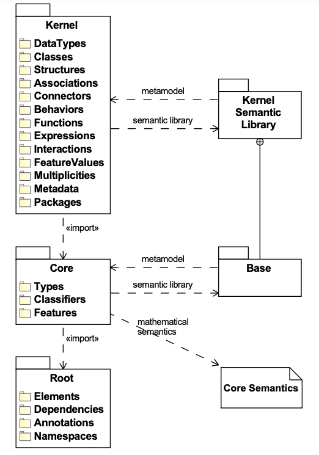

# 8.4 Semantics

## 8.4.1 Semantics Overview

A KerML model is intended to *represent* a system being modeled. The model is *interpreted* to make statements about the modeled system. The model may describe an existing system, in which case, if the model is correct, the statements it is interpreted to make about the system should all be true. A model may also be used to specify an imagined or planned system, in which case the statements the model is interpreted to make should be true for any system that is properly constructed and operated according to the model.

The *semantics* of KerML specify how a KerML model is to be interpreted. The semantics are defined in terms of the abstract syntax representation of the model, and only for models which are *valid* relative to the structure and constraints specified for the KerML abstract syntax (see 8.3). As further specified in this subclause, models expressed in KerML are given semantics by implicitly reusing elements from the semantic models in the Kernel Model Library (see Clause 9). These library models represent conditions on the structure and behavior of the system being modeled, which are further augmented in a user model as appropriate.

A formal specification of semantics allows models to be interpreted consistently. In particular, all KerML models extend library models expressed in KerML itself, understandable by KerML modelers. These library models can then be ultimately reduced to a small, core subset of KerML, which is grounded in mathematical logic. The goal is to provide uniform model interpretation, which improves communication between everyone involved in modeling, including modelers and tool builders.

KerML semantics are specified by a combination of mathematics and model libraries, as illustrated in Figure 41. The left side of this diagram shows the abstract syntax packages corresponding to the three layers of KerML (see 6.1). The right side shows the corresponding semantic layering.

1. The **Root Layer** defines the syntactic foundation of KerML and, as such, does not have a semantic interpretation relative to the modeled system.
2. The **Core Layer** is grounded in mathematical semantics, supported by the `Base` package from the Kernel Model Library (see 9.2.2). Subclause 8.4.3 specifies the semantics of the Core layer.
3. The **Kernel Layer** is given semantics fully through its relationship to the Model Library (see Clause 9). Subclause 8.4.4 specifies the semantics of the Kernel layer.



*Figure 41. KerML Semantic Layers*

## 8.4.2 Semantic Constraints and Implied Relationships

As described in 8.4.1, KerML semantics are specified by a combination of a mathematical interpretation of the Core layer and a set of required relationships between Core and Kernel model elements and elements of the Kernel Semantic Library (see 9.2). The latter requirements are formalized by *semantic constraints* included in the KerML abstract syntax (see also 8.3.1 on the various kinds of constraints in the abstract syntax). Additionally, other semantic constraints require relationships between elements within a user model necessary for the model to be semantically well formed.

Specifically, there are four categories of semantic constraints, each dealing with a different kind of relationship:

1. **Specialization constraints.** These constraints require that `Type` elements of a certain kind directly or indirectly specialize some specific `baseType` from the Kernel Semantic Library. They are the fundamental means for providing semantics to abstract syntax elements in the Kernel layer. Specialization constraints always have the word *Specialization* in their name. For example, `checkDataTypeSpecialization` requires that a `DataType` directly or indirectly specialize the Semantic Library DataType `Base::DataValue`.

2. **Redefinition constraints.** These constraints require that certain `Features` in a model have `Redefinition` relationships with certain other `Features` in the model. While `Redefinitions` are kinds of `Specializations`, redefinition constraints differ from the specialization constraints described above in that they are between two elements of a user model, rather than between an element of a user model and an element of a library model. Redefinition constraints always have the word *Redefinition* in their name. For example, `checkConnectorEndRedefinition` requires that the ends of a `Connector` redefine any ends of the `Types` that it specializes.

3. **Type-featuring constraints.** These constraints require that certain `Features` in a model have `TypeFeaturing` relationships with certain other `Types` in the model. They arise at points in a model in which the `OwningMembership` structure is different than the required `Featuring` relationship, so `FeatureMembership` cannot be used. Type-featuring constraints always have the words *TypeFeaturing* in their name. For example, `checkFeatureValueExpressionTypeFeaturing` requires that the `valueExpression` owned by a `FeatureValue` relationship (a kind of `OwningMembership`) have the same `featuringTypes` as the owning `featureWithValue` of the `FeatureValue`, rather than being featured by the `featureWithValue` itself (as would have been the case for a `FeatureMembership`).

4. **Binding-connector constraints.** These constraints require that `BindingConnectors` exist between certain `Features` in a model. The primary example of such a constraint is `checkFeatureValueBindingConnector`, which requires that the `featureWithValue` of a `FeatureValue` own a `BindingConnector` between itself and the `result` parameter of the `valueExpression` of the `FeatureValue`.

A KerML model parsed from the textual concrete syntax (see 8.2) or obtained through model interchange (see Clause 10) will not necessarily meet the semantic constraints specified for the abstract syntax. In this case, a tool may insert certain *implied* `Relationships` into the model in order to meet the semantic constraints. The overview subclauses for the Core Semantics (see 8.4.3.1) and Kernel Semantics (see 8.4.4.1) include tables that define what implied `Relationships` should be included to satisfy each semantic constraint when it would otherwise be violated. In all cases, the semantics of a model are only defined if it meets all semantic and validation constraints (see 8.3.1).

When including implied `Relationships` for specialization constraints, it is possible that multiple such constraints may apply to a single element. For example, a `Structure` is a kind of `Class`, which is a kind of `Classifier`, and there are specialization constraints for all three of these metaclasses, with corresponding implied `Subclassification` `Relationships`. However, simply including all three implied `Subclassifications` would be redundant, because the `Subclassification` implied by the `checkStructureSpecialization` constraint will also automatically satisfy the `checkClassSpecialization` and `checkClassifierSpecialization` constraints.

Therefore, in order to avoid redundant `Relationships`, a tool should observe the following rules when selecting which `Specializations` to actually include for a certain `specificType`, out of the set of those implied by all specialization constraints applicable to the `Type`:

1. If there is any `ownedSpecialization` or other implied `Specialization` whose `generalType` is a direct or indirect subtype of (but not the same as) the `generalType` of an implied `Specialization`, or if there is an `ownedSpecialization` with the same `generalType`, then that implied `Specialization` should *not* be included.

2. If there are two implied `Specializations` with the same `generalType`, then only one should be included.

> **Note:** The above rules do *not* apply to `Redefinitions` implied by redefinition constraints, because `Redefinition` relationships have semantics beyond just basic `Specialization`.

## 8.4.3 Core Semantics

### 8.4.3.1 Core Semantics Overview

#### 8.4.3.1.1 Core Semantic Constraints

The Core semantics are primarily specified mathematically, but the Core metaclasses `Type`, `Classifier`, and `Feature` also have certain semantic constraints (see 8.4.2). Subclause 8.4.3.1.2 describes the general mathematical framework for Core semantics, with specific rules for `Types`, `Classifiers` and `Features` given in 8.4.3.2, 8.4.3.3, and 8.4.3.4, respectively. The following summarizes the corresponding semantic constraints.

The `checkTypeSpecialization` and `checkFeatureSpecialization` constraints are actually already implied by the mathematical semantics for `Types` and `Features`, but they are included in the abstract syntax so that they can also be reflected syntactically in models by the implied `Relationships` shown in Table 8. In addition, Table 9 lists the implied `Relationships` for semantic constraints on the Core metaclass `Feature` that actually support the semantics of various Kernel-layer constructs, as further described in the Kernel Semantics (8.4.4) subclauses referenced in the table entries for those constraints. In all cases, the `source` and `owningRelatedElement` of the `Relationship` is the `Element` being constrained, with the `target` being as given in the last column of the table.

### Table 8. Core Semantics Implied Relationships

| Semantic Constraint | Implied Relationship | Target |
|---------------------|---------------------|--------|
| `checkTypeSpecialization` | `Subclassification` | `Base::Anything` (see 9.2.2.2.1) |
| `checkFeatureSpecialization` | `Subsetting` | `Base::things` (see 9.2.2.2.7) |

**Notes:**

1. The `checkTypeSpecialization` constraint applies to all `Types`, but the `Subclassification` `Relationship` is only implied for `Classifiers` (see 8.4.3.3).

2. Satisfaction of the `checkFeatureSpecialization` constraint implies satisfaction of the `checkTypeSpecialization` constraint (see 8.4.3.4).

### Table 9. Core Semantics Implied Relationships Supporting Kernel Semantics

| Semantic Constraint | Implied Relationship | Target |
|---------------------|---------------------|--------|
| `checkFeatureDataValueSpecialization` | `Subsetting` | `Base::dataValues` (see 9.2.2.2.3). Supports Data Types Semantics (see 8.4.4.2) |
| `checkFeatureOccurrenceSpecialization` | `Subsetting` | `Occurrences::occurrences` (see 9.2.4.2.14). Supports Classes Semantics (see 8.4.4.3) |
| `checkFeatureSuboccurrenceSpecialization` | `Subsetting` | `Occurrences::Occurrence::suboccurrences` (see 9.2.4.2.13). Supports Classes Semantics (see 8.4.4.3) |
| `checkFeatureFeatureMembershipTypeFeaturing` | `TypeFeaturing` | A `Type` for which `isFeaturingType` is true on the `Feature`. Supports Classes Semantics (see 8.4.4.3). (See Note 1) |
| `checkFeatureObjectSpecialization` | `Subsetting` | `Objects::objects` (see 9.2.5.2.8). Supports Structures Semantics (see 8.4.4.4) |
| `checkFeatureSubobjectSpecialization` | `Subsetting` | `Objects::Object::subobjects` (see 9.2.5.2.7). Supports Structures Semantics (see 8.4.4.4) |
| `checkFeatureEndSpecialization` | `Subsetting` | `Links::Link::participant` (see 9.2.3.2.3). Supports Associations and Connectors Semantics (see 8.4.4.5, 8.4.4.6) |
| `checkFeatureEndRedefinition` | `Redefinition` | The end of the supertype at the same position as the owning `Type` of the `Feature`. Supports Associations and Connectors Semantics (see 8.4.4.5.1) |
| `checkFeatureCrossingSpecialization` | `CrossSubsetting` | A cross `Feature` to be redefined and another `Feature` representing types of the owning end and other end. Supports Associations and Connectors Semantics (see 8.4.4.5.1) |
| `checkFeatureOwnedCrossFeatureRedefinitionSpecialization` | `Subsetting` | The `ownedCrossFeature` of the end being redefined. Supports Associations and Connectors Semantics (see 8.4.4.5.1) |
| `checkFeatureOwnedCrossFeatureTypeFeaturing` | `TypeFeaturing` | The `types` of the owning end and other end. Supports Associations and Connectors Semantics (see 8.4.4.5.1). (See Note 3) |
| `checkFeatureStepSpecialization` | `Subsetting` | `Performances::performances` (see 9.2.6.2.16). Supports Behaviors and Steps Semantics (see 8.4.4.7, 8.4.4.8) |
| `checkFeatureSubperformanceSpecialization` | `Subsetting` | `Performances::Performance::subperformances` (see 9.2.6.2.15). Supports Behaviors and Steps Semantics (see 8.4.4.7, 8.4.4.8) |
| `checkFeatureEnclosedPerformanceSpecialization` | `Subsetting` | `Performances::Performance::enclosedPerformances` (see 9.2.6.2.15). Supports Behaviors and Steps Semantics (see 8.4.4.7, 8.4.4.8) |
| `checkFeatureOwnedResultExpressionRedefinition` | `Redefinition` | `result` parameter of supertype `Expression`. Supports Functions and Expressions Semantics (see 8.4.4.9) |
| `checkFeatureFlowFeatureRedefinition` | `Redefinition` | `Transfer::source::sourceOutput` or `Transfer::target::targetInput` (see 9.2.7.2.9). Supports Flows Semantics (see 8.4.4.10.2) |
| `checkFeatureValuationSpecialization` | `Subsetting` | The `result` of the value `Expression` of an owned `FeatureValue` of a `Feature`. Supports Feature Values Semantics (see 8.4.4.11) |

**Notes:**

1. For the `checkFeatureFeatureMembershipTypeFeaturing` constraint, if the `Feature` has `isVariable = false`, then the target `Type` is the `owningType` of the `Feature`. If the `Feature` has `isVariable = true` and the `owningType` is the base `Class` `Occurrences::Occurrence`, then the target is `Occurrences::Occurrence::snapshots` (see 9.2.4.2.13). Otherwise, the target `Type` shall be constructed so as to satisfy the constraint and shall be owned as an `ownedRelatedElement` of the implied `TypeFeaturing` relationship. For further details, see 8.4.4.3.

2. For the `checkFeatureCrossingSpecialization` constraint on an end `Feature`, the target feature chain shall consist of two `Features`. The first `Feature` is owned by the chain, is typed by the `featuringType` of the `ownedCrossFeature` of the end `Feature`, and is featured by the `owningType` of the end `Feature`. The second `Feature` is the `ownedCrossFeature` of the end `Feature`. For further details, see 8.4.4.5.1.

3. For the `checkFeatureOwnedCrossFeatureTypeFeaturing` constraint, if the `owningType` of the owning end `Feature` has exactly two `endFeatures`, then an `ownedCrossFeature` shall be featured by the `types` of the other end than its owning end `Feature`. If the `owningType` has more than two `endFeatures`, then the `ownedCrossFeature` shall be featured by a `Feature` representing a Cartesian product of the `types` of the other `endFeatures` of the `owningType` than the owning end `Feature` of the `ownedCrossFeature`. For further details, see 8.4.4.5.1.

#### 8.4.3.1.2 Core Semantics Mathematical Preliminaries

The mathematical specification of Core semantics uses a model-theoretic approach. Core mathematical semantics are expressed in first order logic notation, extended as follows:

1. A conjunction specifying that multiple variables are members of the same set can be shortened to a comma-delimited series of variables followed by a single membership symbol (`s1, s2 ∈ S` is short for `s1 ∈ S ∧ s2 ∈ S`). Quantifiers can use this in variable declarations, rather than leaving it to the body of the statement before an implication (`∀tg, ts ∈ VT...` is short for `∀tg, ts tg ∈ VT ∧ ts ∈ VT ⇒ ...`).

2. Dots (`.`) appearing between metaproperty names have the same meaning as in OCL, including implicit collections [OCL].

3. Sets are identified in the usual set-builder notation, which specifies members of a set between curly braces (`{}`). The notation is extended with `#` before an opening brace to refer to the cardinality of a set.

Element names appearing in the mathematical semantics refer to the `Element` itself, rather than its instances, using the same font conventions as given in 8.1.

The mathematical semantics use the following model-theoretic terms, explained in terms of this specification:

- **Vocabulary:** Model elements conforming to the KerML abstract syntax, with additional restrictions given in this subclause.
- **Universe:** All actual or potential things the vocabulary could possibly be about.
- **Interpretation:** The relationship between vocabulary and mathematical structures made of elements of the universe.

The above terms are mathematically defined below.

A **vocabulary** `V = (VT, VC, VF)` is a 3-tuple where:
- `VT` is a set of types (model elements classified by `Type` or its specializations, see 8.3.3.1).
- `VC ⊆ VT` is a set of classifiers (model elements classified by `Classifier` or its specializations, see 8.3.3.2), including at least `Base::Anything` from KerML Semantic Model Library (see 9.2.2).
- `VF ⊆ VT` is a set of features (model elements classified by `Feature` or its specializations, see 8.3.3.3), including at least `Base::things` from the KerML Semantic Model Library (see 9.2.2).
- `VT = VC ∪ VF`

An **interpretation** `I = (Δ, Σ, ·T)` for `V` is a 3-tuple where:
- `Δ` is a non-empty set (universe),
- `Σ = (P, <P)` is a non-empty set `P` with a strict partial ordering `<P` (marking set), and
- `·T` is an (interpretation) function relating elements of the vocabulary to sets of all non-empty tuples (sequences) of elements of the universe, with an element of the marking set in between each one for sequences of multiple elements. It has domain `VT` and co-domain that is the power set of `S`:

```
S = Δ¹ ∪ Δ×P×Δ ∪ Δ×P×Δ×P×Δ …
```

where `Δ¹` is the set of sets of size 1 covering all the elements of the universe (a unary Cartesian power).

The semantics of KerML are restrictions on the interpretation relationship, as given mathematically in this and subsequent subclauses on the Core semantics. The phrase *result of interpreting* a model (vocabulary) element refers to sequences paired with the element by `·T`, also called the *interpretation* of the model element, for short.

The (minimal interpretation) function `·minT` specializes `·T` to the subset of sequences that have no others in the interpretation as tails, except when applied to `Anything`.

```
∀t ∈ Type, s1 ∈ S: s1 ∈ (t)minT ≡ s1 ∈ (t)T ∧ (t ≠ Anything ⇒ (∀s2 ∈ S: s2 ∈ (t)T ∧ s2 ≠ s1 ⇒ ¬tail(s2, s1)))
```

Functions and predicates for sequences are introduced below. Predicates prefixed with `form:` are defined in [fUML], Clause 10 (Base Semantics).

- **length** is a function version of fUML's `sequence-length`:
  ```
  ∀s, n: n = length(s) ≡ (form:sequence-length s n)
  ```

- **at** is a function version of fUML's `in-position-count`:
  ```
  ∀x, s, n: x = at(s, n) ≡ (form:in-position-count s n x)
  ```

- **head** is true if the first sequence is the same as the second for some or all of the second starting at the beginning, otherwise is false:
  ```
  ∀s1, s2: head(s1, s2) ⇒ form:Sequence(s1) ∧ form:Sequence(s2)
  ∀s1, s2: head(s1, s2) ≡ (length(s1) ≤ length(s2)) ∧ (∀i ∈ Z⁺: i ≥ 1 ∧ i ≤ length(s1) ⇒ at(s1, i) = at(s2, i))
  ```

- **tail** is true if the first sequence is the same as the second for some or all of the second finishing at the end, otherwise is false:
  ```
  ∀s1, s2: tail(s1, s2) ⇒ form:Sequence(s1) ∧ form:Sequence(s2)
  ∀s1, s2: tail(s1, s2) ≡ (length(s1) ≤ length(s2)) ∧ (∀h, i ∈ Z⁺: (h = length(s2) − length(s1)) ∧ i > h ∧ i ≤ length(s2) ⇒ at(s1, i−h) = at(s2, i))
  ```

- **head-tail** is true if the first and second sequences are the head and tail of the third sequence, respectively, otherwise is false:
  ```
  ∀s1, s2: head-tail(s1, s2, s0) ⇒ form:Sequence(s1) ∧ form:Sequence(s2) ∧ form:Sequence(s0)
  ∀s1, s2: head-tail(s1, s2, s0) ≡ head(s1, s0) ∧ tail(s2, s0)
  ```

- **concat** is true if the first sequence has the second as head, the third as tail, and its length is the sum of the lengths of the other two, otherwise is false:
  ```
  ∀s0, s1, s2: concat(s0, s1, s2) ⇒ form:Sequence(s0) ∧ form:Sequence(s1) ∧ form:Sequence(s2)
  ∀s0, s1, s2: concat(s0, s1, s2) ≡ (length(s0) = length(s1) + length(s2)) ∧ head-tail(s1, s2, s0)
  ```

- **concat-around** is true if the first sequence has the second as head, the fourth as tail, and the third element in between:
  ```
  ∀s0, s1, p, s2: concat-around(s0, s1, p, s2) ⇒ form:Sequence(s0) ∧ form:Sequence(s1) ∧ form:Sequence(s2)
  ∀s0, s1, p, s2: concat-around(s0, s1, p, s2) ≡ (length(s0) = length(s1) + length(s2) + 1) ∧ head-tail(s1, s2, s0) ∧ at(p, length(s1) + 1)
  ```

- **reverse** is true if the sequences have the same elements, but in reverse order, otherwise is false:
  ```
  ∀s1, s2: reverse(s1, s2) ⇒ form:Sequence(s1) ∧ form:Sequence(s2)
  ∀s1, s2: reverse(s1, s2) ≡ (length(s1) = length(s2)) ∧ (∀i ∈ Z⁺: i ≥ 1 ∧ i ≤ length(s1) ⇒ at(s1, (length(s1) − i + 1) = at(s2, i))
  ```

### 8.4.3.2 Types Semantics

**Abstract syntax reference:** 8.3.3.1

The `checkTypeSpecialization` constraint requires that all `Types` directly or indirectly specialize `Base::Anything` (see 9.2.2.2.1). However, there is *no* implied relationship that shall be inserted to satisfy this constraint for a `Type` that is not a `Classifier` or a `Feature` (see also 8.4.3.3 and 8.4.3.4 on Classifiers and Features, respectively).

The mathematical interpretation (see 8.4.3.1.2) of `Types` in a model shall satisfy the following rules:

1. All sequences in the interpretation of a `Type` are in the interpretations of the `Types` it specializes.
   ```
   ∀tg, ts ∈ VT: tg ∈ ts.specialization.general ⇒ (ts)T ⊆ (tg)T
   ```

2. No sequences in the interpretation of a `Type` are in the interpretations of its disjoining `Types`.
   ```
   ∀t, td ∈ VT: td ∈ t.disjoiningTypeDisjoining.disjoiningType ⇒ ((t)T ∩ (td)T = ∅)
   ```

3. The interpretations of a `Type` that has `unioningTypes` are all and only the interpretations of those `Types`.
   ```
   ∀t ∈ VT, utl: form:Sequence(utl) ∧ utl = t.unioningTypes ∧ length(utl) > 0 ⇒ (t)T = ∪(i=1 to length(utl)) (at(utl, i))T
   ```

4. The interpretations of a `Type` that has `intersectingTypes` are all and only the interpretations in common between all the `Types`.
   ```
   ∀t ∈ VT, itl: form:Sequence(itl) ∧ itl = t.intersectingTypes ∧ length(itl) > 0 ⇒ (t)T = ∩(i=1 to length(itl)) (at(itl, i))T
   ```

5. The interpretations of a `Type` that has `differencingTypes` are all and only the interpretations of the first `differencingType` that are not interpretations of the remaining ones.
   ```
   ∀t ∈ VT, dtl: form:Sequence(dtl) ∧ dtl = t.differencingTypes ∧ length(dtl) > 0 ⇒ (t)T = (at(dtl, 1))T ∖ ∪(i=2 to length(dtl)) (at(dtl, i))T
   ```

### 8.4.3.3 Classifiers Semantics

**Abstract syntax reference:** 8.3.3.2

The `checkTypeSpecialization` constraint is semantically required for `Classifiers` by the rules below. If necessary, it may be syntactically satisfied in a model by inserting an implied `Subclassification` `Relationship` to `Base::Anything` (see also Table 8).

The mathematical interpretation (see 8.4.3.1.2) of the `Classifiers` in a model shall satisfy the following rules:

1. If the interpretation of a `Classifier` includes a sequence, it also includes the 1-tail of that sequence.
   ```
   ∀c ∈ VC, s1 ∈ S: s1 ∈ (c)T ⇒ (∀s2 ∈ S: tail(s2, s1) ∧ length(s2) = 1 ⇒ s2 ∈ (c)T)
   ```

2. The interpretation of the `Classifier` `Anything` includes all sequences of all elements of the universe and markings.
   ```
   (Anything)T = S
   ```

### 8.4.3.4 Features Semantics

**Abstract syntax reference:** 8.3.3.3

The `checkFeatureSpecialization` constraint is semantically required by the first two rules below, combined with the definition of `·T` in 8.4.3.1.2. If necessary, it may be syntactically satisfied in a model by inserting an implied `Subsetting` `Relationship` to `Base::things` (see also Table 8). Note that satisfaction of the `checkFeatureSpecialization` constraint implies satisfaction of the `checkTypeSpecialization` constraint, because `Base::things` is a `FeatureTyping` specialization of `Base::Anything`.

The mathematical interpretation (see 8.4.3.1.2) of the `Features` in a model shall satisfy the following rules:

1. The interpretations of `Features` must have length greater than two.
   ```
   ∀s ∈ S, f ∈ VF: s ∈ (f)T ⇒ length(s) > 2
   ```

2. The interpretation of the `Feature` `things` is all sequences of length greater than two.
   ```
   (things)T = {s | s ∈ S ∧ length(s) > 2}
   ```

`Features` interpreted as sequences of length three or more can be treated as if they were interpreted as ordered triples ("marked" binary relations), where the first and third elements are interpretations of the domain and co-domain of the `Feature`, respectively, while the second element is a *marking* from `P`. The predicate `feature-pair` below determines whether two sequences can be treated in this way.

Two sequences are a **feature pair** of a `Feature` if and only if the interpretation of the `Feature` includes a sequence `s0` such that following are true:
- `s0` is the concatenation of the two sequences, in order, with an element of `P` (marking) in between them.
- The first sequence is in the minimal interpretation of all `featuringTypes` of the `Feature`.
- The second sequence is in the minimal interpretations of all `types` of the `Feature`.

```
∀s1, s2 ∈ S, p ∈ P, f ∈ VF: feature-pair(s1, p, s2, f) ≡
  ∃s0 ∈ S: s0 ∈ (f)T ∧ concat-around(s0, s1, p, s2) ∧
  (∀t1 ∈ VT: t1 ∈ f.featuringType ⇒ s1 ∈ (t1)minT) ∧
  (∀t2 ∈ VT: t2 ∈ f.type ⇒ s2 ∈ (t2)minT)
```

Markings for the same `s1` above can be related by `<P` to order `s2` across multiple interpretations (values) of `f`. Interpretations of `f` can have the same `s1` and `s2`, differing only in `p` to distinguish duplicate `s2` (values of `f`).

The interpretation of the `Features` in a model shall satisfy the following rules:

3. All sequences in an interpretation of a `Feature` have a tail with non-overlapping head and tail that are feature pairs of the `Feature`.
   ```
   ∀s0 ∈ S, f ∈ VF: s0 ∈ (f)T ⇒ ∃st, s1, s2 ∈ S, p ∈ P: tail(st, s0) ∧ head-tail(s1, s2, st) ∧ (length(st) > length(s1) + length(s2)) ∧ feature-pair(s1, p, s2, f)
   ```

4. Values of redefining `Features` are the same as the values of their `redefinedFeatures` restricted to the domain of the redefining `Feature`.
   ```
   ∀fg, fs ∈ VF: fg ∈ fs.redefinedFeature ⇒
     (∀s1 ∈ S: (∀fts ∈ VT: fts ∈ fs.featuringType ⇒ s1 ∈ (fts)minT) ⇒
       (∀s2 ∈ S, p ∈ P: (feature-pair(s1, p, s2, fs) ≡ feature-pair(s1, p, s2, fg))))
   ```

5. The `multiplicity` of a `Feature` includes the cardinality of its values, counting duplicates.
   ```
   ∀s1 ∈ S, f ∈ VF, n ∈ Z⁺: (∀t1 ∈ VT: t1 ∈ f.featuringType ⇒ s1 ∈ (t1)minT) ∧
     n = #{(p, s2) | feature-pair(s1, p, s2, f)} ⇒
     ∃p ∈ P: feature-pair(s1, p, (n), f.multiplicity)
   ```

6. If a `Feature` is unique, there are no values with the same markings.
   ```
   ∀s1, s2 ∈ S, p1, p2 ∈ P, f ∈ VF: f.isUnique ⇒
     (feature-pair(s1, p1, s2, f) ∧ feature-pair(s1, p2, s2, f) ⇒ p1 = p2)
   ```

7. If a `Feature` is ordered, the markings of its values are totally ordered and mark exactly one value each.
   ```
   ∀s1, s2, s3 ∈ S, p1, p2 ∈ P, f ∈ VF: f.isOrdered ⇒
     (feature-pair(s1, p1, s2, f) ∧ feature-pair(s1, p2, s3, f) ⇒ (p1 = p2 ∧ s2 = s3) ∨ p1 <P p2 ∨ p2 <P p1)
   ```

8. Sequences in the interpretation of an inverting feature are the reverse of those in the inverted feature.
   ```
   ∀f1, f2 ∈ VF: f2 ∈ f1.invertingFeatureInverting.invertingFeature ⇒
     (∀s1 ∈ S: s1 ∈ (f1)T ≡ (∃s2 ∈ S: s2 ∈ (f2)T ∧ reverse(s2, s1)))
   ```

9. The interpretation of a `Feature` with a chain is determined by the interpretations of the subchains.
   ```
   ∀f ∈ VF, cfl: cfl = f.chainingFeature ∧ form:Sequence(cfl) ∧ length(cfl) > 1 ⇒ chain-feature-n(f, cfl)
   ```

## 8.4.4 Kernel Semantics

### 8.4.4.1 Kernel Semantics Overview

The semantics of constructs in the Kernel Layer are specified in terms of the foundational constructs defined in the Core layer supported by reuse of model elements from the Kernel Semantic Model Library (see 9.2). The most common way in which library model elements are used is through specialization, in order to meet subtyping constraints specified in the abstract syntax. For example, `Structures` are required to (directly or indirectly) subclassify `Object` from the `Objects` library model, while `Features` typed by `Structures` must subset `objects`. Similarly, `Behaviors` must subclassify `Performance` from the `Performances` library model, while `Steps` (`Features` typed by `Behaviors`) must subset `performances`. The requirement for such specialization is specified by specialization constraints in the abstract syntax, as listed in Table 10 along with the implied `Specializations` that may be used to satisfy them (see 8.4.2 for discussion of specialization constraints and implied `Relationships`).

Sometimes more complicated reuse patterns are needed. For example, binary `Associations` (with exactly two ends) specialize `BinaryLink` from the library, and additionally require the ends of the `Association` to redefine the `source` and `target` ends of `BinaryLink`. Such patterns are specified by redefinition constraints and other kinds of semantic constraints in the abstract syntax, as listed in Table 11 along with the implied `Relationships` that may be used to satisfy them (see also 8.4.2). In addition the Core semantic constraints listed in Table 9 actually support the semantics of Kernel layer constructs.

In all cases, all Kernel syntactic constructs can be ultimately reduced to semantically equivalent Core patterns. Various elements of the Kernel abstract syntax essentially act as "markers" for modeling patterns typing the Kernel to the Core. The following subclauses specify the semantics for each syntactic area of the Kernel Layer in terms of the semantic constraints that must be satisfied for various Kernel elements, the pattern of relationships these imply, and the model library elements that are reused to support this.

### Table 10. Kernel Semantics Implied Specializations

| Semantic Constraint | Implied Relationship | Target |
|---------------------|---------------------|--------|
| `checkDataTypeSpecialization` | `Subclassification` | `Base::DataValue` (see 9.2.2.2.2) |
| `checkClassSpecialization` | `Subclassification` | `Occurrences::Occurrence` (see 9.2.4.2.13) |
| `checkStructureSpecialization` | `Subclassification` | `Objects::Object` (see 9.2.5.2.7) |
| `checkAssociationSpecialization` | `Subclassification` | `Links::Link` (see 9.2.3.2.3) |
| `checkAssociationBinarySpecialization` | `Subclassification` | `Links::BinaryLink` (see 9.2.3.2.4) |
| `checkAssociationStructureSpecialization` | `Subclassification` | `Objects::LinkObject` (see 9.2.5.2.10) |
| `checkBehaviorSpecialization` | `Subclassification` | `Performances::Performance` (see 9.2.6.2.15) |
| `checkFunctionSpecialization` | `Subclassification` | `Performances::Evaluation` (see 9.2.6.2.8) |
| `checkPredicateSpecialization` | `Subclassification` | `Performances::BooleanEvaluation` (see 9.2.6.2.2) |
| `checkInteractionSpecialization` | `Subclassification` | `Transfers::Transfer` (see 9.2.7.2.9) |
| `checkSuccessionSpecialization` | `Subclassification` | `Occurrences::HappensBefore` (see 9.2.4.2.9) |
| `checkSuccessionFlowSpecialization` | `Subclassification` | `Transfers::FlowTransfer` (see 9.2.7.2.5) |
| `checkMetaclassSpecialization` | `Subclassification` | `Metaobjects::Metaobject` (see 9.2.16.2.2) |
| `checkMetadataFeatureMetaclassSpecialization` | `FeatureTyping` | `Metaobjects::Metaobject` (see 9.2.16.2.2) |
| `checkMetadataFeatureSemanticSpecialization` | See Note 2 | `baseType` of `SemanticMetadata` (see 9.2.16.2.3) |
| `checkFeatureReferenceExpressionResultSpecialization` | `Subsetting` | The `referent` of the `FeatureReferenceExpression` |
| `checkConstructorExpressionResultSpecialization` | See Note 3 | The `instantiatedType` of the `ConstructorExpression` |
| `checkInvocationExpressionResultSpecialization` | See Note 3 | The `instantiatedType` of the `InvocationExpression` |
| `checkFeatureChainExpressionResultSpecialization` | `Subsetting` | The last `Feature` in the `targetFeature` chain |
| `checkSelectExpressionResultSpecialization` | `Subsetting` | The `referent` of the `SelectExpression` |
| `checkIndexExpressionResultSpecialization` | `Subsetting` | The `referent` of the `IndexExpression` |

**Notes:**

1. For all constraints *other than* `checkMetadataFeatureSemanticSpecialization` and the other constraints listed below, the `source` of any implied `Relationship` is the annotated element of the constraint, with the `target` as given in the table. For `checkMetadataFeatureSemanticSpecialization`, see Note 2. For the following constraints, the `source` is the `result` parameter of the `Expression` that is the annotated element of the constraint:
   - `checkFeatureReferenceExpressionResultSpecialization`
   - `checkConstructorExpressionResultSpecialization`
   - `checkInvocationExpressionResultSpecialization`
   - `checkFeatureChainExpressionResultSpecialization`
   - `checkSelectExpressionResultSpecialization`
   - `checkIndexExpressionResultSpecialization`

2. The `checkMetadataFeatureSemanticSpecialization` constraint only applies to a `MetadataFeature` that has a `metaclass` that is a kind of `SemanticMetadata` (see 9.2.16.2.3). The source of the implied `Relationship` for this constraint is *not* the `MetadataFeature` but, rather, the `Type` annotated by the `MetadataFeature`, and a conforming tool need only insert the `Relationship` if the `MetadataFeature` is an `ownedMember` of the `Type`. The kind of `Relationship` that is implied and its `target` are determined as follows:
   - If the annotated `Type` and the `baseType` are both `Classifiers`, then `Subclassification` targeting the `baseType`.
   - If the annotated `Type` is a `Feature` and the `baseType` is a `Classifier`, then `FeatureTyping` targeting the `baseType`.
   - If the annotated `Type` and the `baseType` are both `Features`, then `Subsetting` targeting the `baseType`.
   - If the annotated `Type` is a `Classifier` and the `baseType` is a `Feature`, then `Subclassifications` targeting each of the types of the `Feature`.

3. For the `checkConstructorExpressionResultSpecialization` and `checkInvocationExpressionSpecialization` constraints, the implied `Relationship` is a `Subclassification` if the `instantiatedType` is a `Classifier`, a `Subsetting` if the `instantiatedType` is a `Feature`, and a `Specialization` otherwise.

### Table 11. Kernel Semantics Other Implied Relationships

| Semantic Constraint | Implied Relationship | Target |
|---------------------|---------------------|--------|
| `checkConnectorEndRedefinition` | `Redefinition` | The end of a supertype `Connector` at the same position |
| `checkConnectorTypeFeaturing` | `TypeFeaturing` | The `defaultFeaturingType` of the `Connector` (See Note 2) |
| `checkSuccessionSourceRedefinition` | `Redefinition` | `Occurrences::HappensBefore::earlierOccurrence` (see 9.2.4.2.9) |
| `checkSuccessionTargetRedefinition` | `Redefinition` | `Occurrences::HappensBefore::laterOccurrence` (see 9.2.4.2.9) |
| `checkInvocationExpressionBehaviorBindingConnector` | `BindingConnector` | `behavior` of `InvocationExpression` to `instantiatedType` (See Note 3) |
| `checkConstructorExpressionResultDefaultValueBindingConnector` | `BindingConnector` | See Note 4 |
| `checkInvocationExpressionDefaultValueBindingConnector` | `BindingConnector` | See Note 4 |
| `checkFeatureValueBindingConnector` | `BindingConnector` | `featureWithValue` to `result` of `valueExpression` |
| `checkFeatureValueExpressionTypeFeaturing` | `TypeFeaturing` | `featuringTypes` of `featureWithValue` |
| `checkFeatureChainExpressionTargetRedefinition` | `Redefinition` | See Note 5 |
| `checkFeatureChainExpressionSourceTargetRedefinition` | `Redefinition` | See Note 5 |
| `checkConstructorExpressionResultFeatureRedefinition` | `Redefinition` | See Note 6 |

**Notes:**

1. For redefinition and type featuring constraints, except for `checkConstructorExpressionResultFeatureRedefinition`, the annotated element of the constraint is the `source` and `owningRelatedElement` of the implied `Relationship`, with the `target` as given in the last column of the table. For the `checkConstructorExpressionResultFeatureRedefinition` constraint, the `source` is an `ownedFeature` of the `result` parameter of the `ConstructorExpression`. For binding connector constraints, the annotated element of the constraint is the `owningNamespace` of the implied `Relationship`, with the `source` and `target` of the `Relationship` as given in the last column of the table.

2. For the `checkConnectorTypeFeaturing` constraint, an implied `TypeFeaturing` shall only be included to satisfy the constraint if the `Connector` has no `owningType`, no non-implied `ownedTypeFeaturings`, and a non-null `defaultFeaturingType`.

3. The `checkInvocationExpressionBehaviorBindingConnector` constraint only applies if the `instantiatedType` is not a `Function` or a `Feature` typed by a `Function`.

4. The `checkConstructorExpressionResultDefaultValueBindingConnector` and `checkInvocationExpressionDefaultValueBindingConnector` constraints apply to each `ownedFeature` that redefines a `Feature` for which there is an *effective default value* (see 8.4.4.11).

5. For the `checkFeatureChainExpressionTargetRedefinition` and `checkFeatureChainExpressionSourceTargetRedefinition` constraints, the `redefiningFeature` of the implied `Redefinition` is a nested `Feature` of the first owned input parameter of the `FeatureChainExpression` (corresponding to the `source` parameter of the `.` `Function`).

6. For the `checkConstructorExpressionResultFeatureRedefinition` constraint, the target of the `Redefinition` shall be the `feature` of the `instantiatedType` at the same position in order in the `instantiatingType` as the position of the redefining `ownedFeature` in the `ConstructorExpression` `result` parameter.

### 8.4.4.2 Data Types Semantics

**Abstract syntax reference:** 8.3.4.1

The `checkDataTypeSpecialization` constraint requires that `DataTypes` specialize the base `DataType` `Base::DataValue` (see 9.2.2.2.2). The `checkFeatureDataValueSpecialization` constraint requires that `Features` typed by a `DataType` specialize the `Feature` `Base::dataValues` (see 9.2.2.2.3), which is typed by `Base::DataValue`.

```kerml
datatype D specializes Base::DataValue {
    feature a : ScalarValue::String subsets Base::dataValues;
    feature b : D subsets Base::dataValues;
}
```

The `Type` `Base::DataValue` is disjoint with `Occurrences::Occurrence` and `Links::Link`, the base `Types` for `Classes` and `Associations` (see 8.4.4.3 and 8.4.4.5, respectively). This means that a `DataType` cannot specialize a `Class` or `Association` and that a `Feature` typed by a `DataType` cannot also be typed by a `Class` or `Association`.

### 8.4.4.3 Classes Semantics

**Abstract syntax reference:** 8.3.4.2

The `checkClassSpecialization` constraint requires that `Classes` specialize the base `Class` `Occurrences::Occurrence` (see 9.2.4.2.13). The `checkFeatureOccurrenceSpecialization` constraint requires that `Features` typed by a `Class` specialize the `Feature` `Occurrences::occurrences` (see 9.2.4.2.14), which is typed by `Occurrences::Occurrence`. Further, the `checkFeatureSuboccurrenceSpecialization` constraint requires that composite `Features` typed by a `Class`, and whose `owningType` is a `Class` or another `Feature` typed by a `Class`, specialize the `Feature` `Occurrences::Occurrence::suboccurrences` (see 9.2.4.2.13), which subsets `Occurrences::occurrences`.

```kerml
class C specializes Occurrences::Occurrence {
    feature a : C subsets Occurrences::occurrences;
    composite feature b : C subsets Occurrences::Occurrence::suboccurrences;
}
```

The `Class` `Occurrences::Occurrence` is disjoint with `Base::DataValues`, the base `Type` for `DataTypes` (see 8.4.4.2). This means that a `Class` cannot specialize a `DataType` and that a `Feature` typed by a `Class` cannot also be typed by a `DataType`. Note that `Occurrences::Occurrence` is *not* disjoint with `Link::Links`, because an `AssociationStructure` is both an `Association` and a `Structure` (which is a kind of `Class`), so the base `AssociationStructure` `Objects::LinkObject` specializes both `Link::Links` and (indirectly) `Occurrences::Occurrence`.

Unlike `DataValues`, `Occurrences` are modeled as occurring in three-dimensional space and persisting over time. The `Occurrences` library model includes an extensive set of `Associations` between `Occurrences` that model various spatial and temporal relations, such as `InsideOf`, `OutsideOf`, `HappensBefore`, `HappensDuring`, etc. In particular, the `Association` `HappensBefore` is the base `Type` for `Successions`, the basic modeling construct for time-ordering `Occurrences` (see 8.4.4.6 on the semantics of `Successions`). For further detail on the `Occurrences` model, see 9.2.4.1.

### 8.4.4.4 Structures Semantics

**Abstract syntax reference:** 8.3.4.3

The `checkStructureSpecialization` constraint requires that `Structures` specialize the base `Structure` `Objects::Object` (see 9.2.5.2.7). The `checkFeatureObjectSpecialization` constraint requires that `Features` typed by a `Structure` specialize the `Feature` `Objects::objects` (see 9.2.5.2.8), which is typed by `Objects::Object`. Further, the `checkFeatureSubobjectSpecialization` constraint requires that composite `Features` typed by a `Structure`, and whose `owningType` is a `Structure` or another `Feature` typed by a `Structure`, specialize the `Feature` `Objects::Object::subobjects` (see 9.2.5.2.7), which subsets `Object::objects`.

```kerml
struct S specializes Objects::Object {
    feature a : S subsets Object::objects;
    composite feature b : S subsets Objects::Object::subobjects;
}
```

`Objects` are `Occurrences` representing physical or virtual structures that occur over time. For physical structures, the `Objects` library model also provides the specialization `StructuredSpaceObject`, which models `Objects` that can be spatially decomposed into cells of the same or lower dimension. The `Type` `Object` is disjoint with the `Type` `Performance`, another specialization of `Occurrence`, which is the base `Type` for `Behaviors` (see 8.4.4.7 on the semantics of `Behaviors`). For further detail on the `Objects` model, see 9.2.5.1.

### 8.4.4.5 Associations Semantics

**Abstract Syntax Reference:** 8.3.4.4

The `checkAssociationSpecialization` and `checkFeatureEndSpecialization` constraints require that an `Association` specialize the base `Association` `Links::Link` (see 9.2.3.2.3) and that its `associationEnds` subset `Links::Link::participant`. In addition, the `validateFeatureEndMultiplicity` constraint requires that the `associationEnds` must have multiplicity `1..1`. These constraints essentially require an N-ary `Association` to have the form (with implied relationships included):

```kerml
assoc A specializes Links::Link {
    end feature e1[1..1] subsets Links::Link::participant;
    end feature e2[1..1] subsets Links::Link::participant;
    ...
    end feature eN[1..1] subsets Links::Link::participant;
}
```

The `checkAssociationBinarySpecialization` constraint requires that a binary `Association` (one with exactly two `associationEnds`) specialize `Links::BinaryLink`.

### 8.4.4.7 Behaviors Semantics

**Abstract syntax reference:** 8.3.4.6

The `checkBehaviorSpecialization` constraint requires that `Behaviors` specialize the base `Behavior` `Performances::Performance` (see 9.2.6.2.15). The `checkFeatureStepSpecialization` constraint requires that `Steps` (i.e., `Features` typed by `Behaviors`) specialize `Performances::performances` (see 9.2.6.2.16).

### 8.4.4.9 Functions and Expressions Semantics

**Abstract syntax reference:** 8.3.4.8

The `checkFunctionSpecialization` constraint requires that `Functions` specialize `Performances::Evaluation` (see 9.2.6.2.8). The `checkPredicateSpecialization` constraint requires that `Predicates` specialize `Performances::BooleanEvaluation` (see 9.2.6.2.2).

### 8.4.4.11 Feature Values Semantics

**Abstract syntax reference:** 8.3.3.3.12

The `checkFeatureValueBindingConnector` constraint requires that the `featureWithValue` of a `FeatureValue` own a `BindingConnector` between itself and the `result` parameter of the `valueExpression` of the `FeatureValue`.

The `checkFeatureValuationSpecialization` constraint requires that a `Feature` with an owned `FeatureValue` subset the `result` of the value `Expression`.

---

*This document is based on the KerML Specification v1.0*
